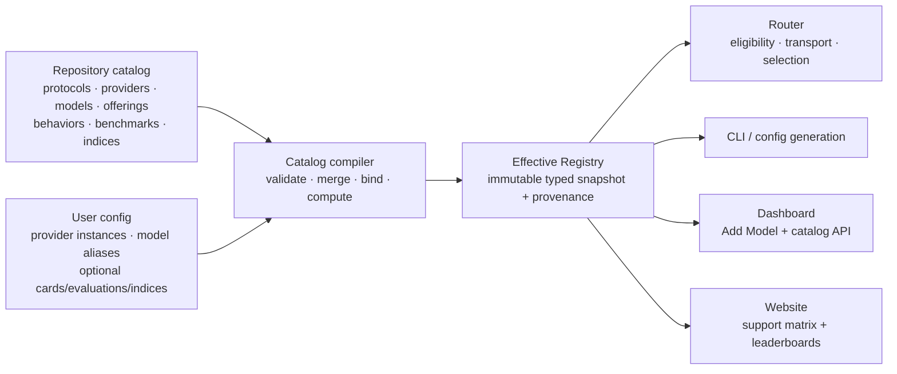

> **Status:** Proposal · **Created:** 2026-09-04

## Problem

vLLM Semantic Router currently describes model support in several independent
places:

- Router configuration owns logical model cards, backend bindings, pricing,
  API format, and operator-authored reasoning families;
- `pkg/config/helper.go` owns a second provider-type table for authentication and
  request paths;
- the Dashboard owns a separate provider-preset list and provider logos;
- the CLI built-in catalog owns only the packaged Mixture-of-Models virtual
  models and their recommended physical pools;
- selection, Looper, training, and Evaluation each interpret a scalar
  `quality_score` differently.

The result is not a coherent Day-0 support boundary. Adding a provider or model
can require synchronized edits across Go, Python, TypeScript, YAML, examples,
and tests, while the Dashboard can advertise a provider preset that the Router
does not support as a native provider type. A single quality number also hides
which benchmarks were measured, how they were normalized, and whether missing
data was silently treated as a poor result.

## Current baseline

The following inventory describes the repository at proposal time. The terms
are intentionally precise: a UI preset is not automatically a native adapter,
and a recommended model reference is not a complete built-in model card.

| Surface | Current built-in inventory | Meaning |
| --- | --- | --- |
| Router provider types | `openai`, `anthropic`, `azure-openai`, `bedrock`, `gemini`, `vertex-ai`, `minimax` | Seven runtime types with hard-coded auth and path defaults |
| Inbound/upstream protocol families | OpenAI Chat Completions, OpenAI Responses, Anthropic Messages | Protocol codecs and request paths implemented by the Router |
| Dashboard “Start here” presets | vLLM, SGLang, AMD ATOM, OpenAI Compatible | Four connection-form presets |
| Dashboard model API presets | OpenRouter, OpenAI, Anthropic, Google Gemini, DeepSeek, Groq, Together AI, Fireworks AI, Mistral AI, xAI, Cerebras, NVIDIA NIM, Perplexity, Cohere, DeepInfra, Hugging Face, SambaNova, DashScope, MiniMax, Moonshot AI, Z.ai, Novita AI, Nebius AI Studio, Featherless AI, FriendliAI, Vercel AI Gateway, CometAPI, Sakana AI | Twenty-eight UX presets, mostly using compatibility protocols |
| Dashboard private-runtime presets | Anthropic Compatible, Ollama, LM Studio, Xinference, NVIDIA Riva, NVIDIA Triton, Docker Model Runner, Lemonade | Eight UX presets |
| CLI built-in virtual models | `vllm-sr/mom-v1-blend`, `vllm-sr/mom-v1-lite`, `vllm-sr/mom-v1-flash`, `vllm-sr/mom-v1-ultra`, `vllm-sr/mom-v1-vault` | Five packaged virtual models |
| Recommended physical references | `local/qwen3.5-9b`, `local/qwen3.6-35b`, `local/step-3.7-flash`, `local/qwen3.5-122b`, `local/mistral-small-4`, `local/glm-5.2`, `local/gpt-oss-120b` | Seven pool recommendations, not yet full model cards |

The Dashboard therefore contains 40 provider presets, while the Router has
seven native provider types and the packaged catalog has no general-purpose
physical-model registry. This proposal makes those distinctions visible rather
than flattening them into one unsupported claim.

## Goals

1. Define one repository-owned catalog for protocols, providers, models,
   provider offerings, reasoning behavior, presentation metadata, benchmarks,
   and composite indices.
2. Generate Router, CLI, Dashboard, website, schema, and documentation views
   from the same validated source.
3. Keep ordinary user configuration short while preserving explicit,
   handwritten model cards for self-hosted and private models.
4. Replace ambiguous `quality_score` values with versioned measurements,
   reproducible index definitions, coverage, confidence, and provenance.
5. Make one model or provider Day-0 support change data-first, reviewable, and
   mechanically complete.
6. Preserve provider logos and improve the Dashboard Add Model flow without
   making catalog internals part of the user contract.

## Non-goals

- The catalog does not discover arbitrary internet models at Router startup.
- It does not turn provider compatibility into a claim of native semantic
  parity.
- It does not combine intelligence, latency, price, availability, and load into
  one opaque number. Those remain separate routing objectives.
- It does not redistribute third-party benchmark data without permission.
- It does not require every new model to have a composite score on release day.
  Missing evidence remains explicitly unavailable.
- Phase 0 does not add a new physical model or change runtime model behavior.

## Design principles

- **One source, many views.** Catalog data is authored once and compiled into
  typed runtime and presentation artifacts.
- **Facts before defaults.** Protocol capabilities, model capabilities, and
  benchmark measurements remain distinct facts; defaults only select among
  them.
- **Intrinsic model versus provider offering.** Context, modalities, and model
  behavior belong to a model card. Endpoint paths, provider model IDs,
  availability, and prices belong to an offering.
- **Explicit identity.** Canonical catalog identity never depends on a
  request-facing alias.
- **Evidence is append-only by identity.** A new evaluation does not silently
  rewrite a previous measurement.
- **Unknown is not zero.** Missing, failed, unsupported, and not-applicable are
  different states.
- **No runtime compatibility layer.** The final config cut is a new major
  contract with one migration command, not two permanent parsers.

## Architecture



The compiler is the only component allowed to join catalog resources. Runtime
consumers receive an immutable `EffectiveRegistry`; they do not repeat provider
switches or merge rules.

## Canonical catalog resources

| Resource | Owns | Does not own |
| --- | --- | --- |
| `ProtocolDefinition` | Operations, paths, request/response codec, streaming, tool-call representation, error semantics, parameter locations | Provider credentials, model context limits, prices |
| `ProviderDefinition` | Canonical provider identity, auth strategy, transport defaults, supported protocol adapters, support tier, display name, logo assets | Request-facing aliases, model intelligence |
| `ModelCard` | Canonical model identity, family/revision, release and knowledge dates, input/output limits, modalities, capabilities, reasoning behavior reference, lifecycle | Endpoint URL, credentials, provider price |
| `OfferingDefinition` | A provider/model pairing, provider model ID, supported operations, endpoint template, parameter restrictions, service tiers, region/availability, dated pricing | Provider-independent model facts, routing alias |
| `ReasoningFamilyDefinition` | Protocol-specific request projection, effort vocabulary/defaults, incompatible parameters, response extraction | Operator credentials, quality ranking |
| `BenchmarkDefinition` | Benchmark/version identity, domain, metric definitions, direction, valid range, units, harness contract | A model's result |
| `EvaluationRecord` | Exact evaluated subject, raw measurements, method, environment, date, uncertainty, evidence and provenance | Aggregation policy |
| `IndexDefinition` | Versioned components, weights, normalization, missing-data policy, scale | Raw benchmark output |
| `IndexResult` | Computed score, domain subscores, coverage, uncertainty, component lineage | Mutable operator preference |

### Stable identities

- Provider IDs use stable slugs such as `openai` or `vllm`.
- Model-card names use namespaced IDs such as `organization/model-id`.
- Protocol, benchmark, and index identities include a version. Composite index
  versions use full semantic-version strings, for example
  `vllm-sr/intelligence@1.0.0`.
- An offering is keyed by `(provider, model, offering revision)` rather than by
  a display label.
- A model revision, quantization, runtime, and reasoning effort are part of an
  evaluation subject. Results from materially different subjects are not
  silently pooled.

## User-facing configuration

Catalog version and digest are build/runtime metadata. They are not fields in
ordinary YAML and are never required from a user. A read-only status endpoint
may expose them for diagnostics and reproducibility.

### Built-in provider and model

The minimum configuration names a provider instance, a request-facing model,
and their catalog identities:

The `vendor-cloud` and `vendor/reasoner-v1` IDs below are illustrative schema
values, not new support claims.

```yaml
version: v0.4

providers:
  - name: primary
    catalog: vendor-cloud
    credentials:
      api_key_env: VENDOR_API_KEY

models:
  - name: frontier
    catalog: vendor/reasoner-v1
    provider: primary
```

The identities have separate meanings:

- `providers[].name` is a local provider-instance name;
- `providers[].catalog` is a built-in provider definition;
- `models[].name` is the logical alias accepted in requests and routing rules;
- `models[].catalog` is the canonical model-card name;
- `models[].provider` explicitly selects the provider instance.

There is no implicit join on the two `name` fields and no
`routing_overrides` or `deployment` resource.

### Handwritten override of a built-in card

Built-in cards materialize automatically, but they remain overridable. The
card's `name` is deliberately the same value referenced by
`models[].catalog`, making the target unambiguous:

```yaml
models:
  - name: frontier
    catalog: vendor/reasoner-v1
    provider: primary

model_cards:
  - name: vendor/reasoner-v1
    description: Restricted production profile
    context_window_size: 128000
    capabilities: [chat, tools]
    tags: [production, approved]
```

The compiler loads built-ins first and then applies typed operator overlays:

- scalar fields replace a built-in value when present;
- maps merge by key;
- lists replace as a whole so their result is reviewable;
- immutable canonical identity and third-party evidence cannot be rewritten;
- every effective field retains `builtin` or `operator` provenance;
- widening a verified capability requires an operator verification record;
  narrowing a capability or limit is allowed directly.

### Fully custom vLLM or SGLang model

When `model_cards[].name` does not exist in the built-in catalog, it defines a
custom card. This is the expected path for private, fine-tuned, quantized, or
newly served models:

```yaml
providers:
  - name: lab-vllm
    catalog: vllm
    base_url: http://model-gateway.example/v1
    credentials:
      api_key_env: LAB_VLLM_API_KEY

models:
  - name: private-reasoner
    catalog: acme/qwen3-custom
    provider: lab-vllm
    provider_model_id: qwen3-custom-awq

model_cards:
  - name: acme/qwen3-custom
    display_name: Qwen3 Custom
    revision: internal-2026-09-01
    context_window_size: 131072
    max_output_tokens: 32768
    modalities:
      input: [text]
      output: [text]
    capabilities: [chat, tools, structured_output, reasoning]
    reasoning:
      type: chat_template_kwargs
      parameter: reasoning_effort
      levels: [low, medium, high]
      default: medium
    tags: [private, awq]
```

Built-in reasoning families are catalog data and require no user-authored
`reasoning_families` block. Only custom models need the inline reasoning
contract above, or a reference to a user-defined family when several private
models share one behavior.

### Custom evaluation and index

Operators may attach reproducible measurements and define an additional index
without changing built-ins:

```yaml
evaluations:
  benchmarks:
    - name: acme/support-bench@1.0.0
      domain: support
      metrics:
        - name: resolution_rate
          type: proportion
          range: [0, 1]
          direction: higher_is_better
  records:
    - id: acme/qwen3-custom/support-bench/run-2026-09-01
      model: acme/qwen3-custom
      benchmark: acme/support-bench@1.0.0
      metrics:
        resolution_rate: 0.82
      evidence:
        origin: operator
        artifact: sha256:0123456789abcdef0123456789abcdef0123456789abcdef0123456789abcdef
  indices:
    - name: acme/support-readiness@1.0.0
      scale: [0, 100]
      missing:
        policy: require_all
      components:
        - index: vllm-sr/intelligence@1.0.0
          weight: 0.30
        - metric: acme/support-bench@1.0.0#resolution_rate
          weight: 0.70

routing:
  selection:
    quality:
      index: acme/support-readiness@1.0.0
      on_missing: ignore_factor
```

An unavailable score stays unavailable. `ignore_factor` means the selection
algorithm renormalizes its other objectives for that candidate; it does not
invent a zero or neutral benchmark result.

## Protocol and backend API ownership

Backend API specifications live in the protocol registry, not in model-card
logos, provider forms, or scattered path constants. Initial definitions cover:

| Protocol | Operations owned by the definition | Examples of protocol semantics |
| --- | --- | --- |
| `openai/chat-completions@1` | `POST /v1/chat/completions` | Chat messages, streaming deltas, tools, usage, finish reasons |
| `openai/responses@1` | Create/retrieve/delete response and input-item operations | Typed input/output items, response lifecycle, streaming events |
| `anthropic/messages@1` | `POST /v1/messages` and explicitly supported auxiliary operations | Messages/content blocks, tool use, usage, stop reasons |

A provider definition selects an auth strategy and protocol adapter. An
offering declares which protocol operations a particular model supports and
any model-specific parameter restrictions. Code adapters remain necessary only
for true semantic differences such as cloud signing, deployment-scoped URL
construction, event translation, or non-compatible error behavior.

This separates three questions that are currently conflated:

1. Can the Router decode and encode this protocol?
2. Can the provider transport that protocol correctly?
3. Does this model offering support this operation and parameter set?

## Replacing provider glue

The current provider-type registry in `pkg/config/helper.go` is migration
evidence, not the destination architecture. The final implementation replaces
it with four narrow seams:

1. **Compiled provider data** for base URL, auth strategy ID, default protocol,
   presentation, and support tier.
2. **Transport resolver** for generic URL/path/header resolution.
3. **Auth strategy registry** for bearer, API-key header, cloud signing, and
   workload-identity behavior.
4. **Protocol/provider adapters** only where wire semantics genuinely differ.

No central switch grows when a data-only compatible provider is added. A new
adapter is registered beside its implementation and conformance fixtures, not
as another case in a generic config helper. Generated enums and validation
tables come from the catalog compiler.

The same cut removes these steady-state duplicates:

- Dashboard `modelProviderCatalog.ts` as an independently maintained inventory;
- hand-maintained provider logos outside provider presentation metadata;
- operator-authored built-in reasoning families;
- model API format and request-path defaults spread across config helpers;
- scalar model quality fallbacks based on parameter count.

## Materialization pipeline

The compiler performs the following deterministic stages:

1. Load repository-owned protocol, provider, model, offering, reasoning,
   benchmark, and index definitions embedded in the release.
2. Validate schemas, canonical IDs, full versions, references, uniqueness, and
   catalog-level invariants.
3. Load user provider instances, model aliases, optional model-card overlays,
   custom cards, evaluation records, and custom index definitions.
4. Apply field-specific merge rules while retaining source provenance.
5. Join every model alias to exactly one card, provider instance, compatible
   offering, protocol adapter, and reasoning behavior.
6. Validate hard eligibility facts, parameter compatibility, auth requirements,
   and endpoint construction.
7. Validate benchmark metrics and compute every acyclic index whose missing-data
   policy is satisfied.
8. Emit one immutable `EffectiveRegistry` consumed by the Router, CLI,
   Dashboard API, config generators, and static website generator.

Compiler failures are actionable and path-specific. Unknown references,
duplicate IDs, cycles, invalid weights, out-of-range metrics, unsupported
protocol operations, and capability widening without verification fail before
traffic starts.

## Evaluation data model

### Benchmark definitions

Each metric declares its unit, valid range, and direction independently:

```yaml
name: terminal-bench@2.1
domain: coding
metrics:
  - name: pass_rate
    type: proportion
    range: [0, 1]
    direction: higher_is_better
```

Metric IDs are stable only within a benchmark version. Changing a dataset,
grader, prompt protocol, aggregation rule, or material harness behavior requires
a new benchmark version.

### Evaluation records

An evaluation record freezes enough context to decide whether two results are
comparable:

- canonical model and exact model revision;
- provider offering and provider model ID when relevant;
- runtime and runtime version;
- quantization, precision, tensor parallelism, and material serving flags;
- protocol, reasoning effort, sampling parameters, and system prompt policy;
- dataset and harness revision, samples, repeats, estimator, and random seeds;
- raw metric values, uncertainty or confidence interval, timestamp, and status;
- evidence URI/digest, license/redistribution status, and provenance.

Provenance is one of `vendor_claimed`, `third_party`, `vllm_sr_reproduced`, or
`operator`. Verification is separately recorded as `claimed`, `imported`, or
`reproduced`. For an otherwise equivalent subject, consumers prefer reproduced
vLLM-SR evidence, then independent third-party evidence, then a vendor claim,
then an unverified operator prior. The source is never hidden from the user.

### Index definitions

An index is a pure, versioned calculation over metrics or other indices:

```yaml
name: example/index@1.0.0
scale: [0, 100]
aggregation: weighted_mean
missing:
  policy: require_coverage
  minimum: 0.80
components:
  - metric: benchmark-a@1.0.0#accuracy
    weight: 0.60
    normalization:
      type: identity
  - metric: benchmark-b@2.0.0#error_rate
    weight: 0.40
    normalization:
      type: one_minus
```

Supported normalization primitives are deliberately small and auditable:
`identity`, `one_minus`, `linear_clamp`, `piecewise_linear`, `logistic`, and
`lookup`. The compiler verifies component weights, metric ranges, directions,
references, and cycles.

Supported missing-data policies are:

- `require_all`: unavailable unless every component exists;
- `require_coverage`: available only above an explicit weight threshold;
- `reported_only`: descriptive result over reported components, never eligible
  for the default comparable leaderboard.

For an explicitly permitted partial result:

```text
coverage = sum(weight of present components)
score = 100 * sum(weight * normalized value) / coverage
```

Every `IndexResult` contains `score`, `status`, `coverage`, uncertainty,
domain subscores, component contributions, and `computed_from` record IDs. A
score of zero is therefore distinguishable from an unavailable score.

## Default intelligence index

The default model-intelligence algorithm is
`vllm-sr/intelligence@1.0.0`, derived from the publicly documented
[Artificial Analysis Intelligence Index v4.1.1 methodology](https://artificialanalysis.ai/methodology/intelligence-benchmarking).
It is a model-quality index, not an efficiency or routing-utility score.

| Domain | Component | Weight | Normalization |
| --- | --- | ---: | --- |
| Agents | GDPval-AA v2 | 20% | `clamp((Elo - 500) / 2000, 0, 1)` |
| Agents | τ³-Banking | 14% | Identity on a validated 0–1 result |
| Coding | Terminal-Bench v2.1 | 16% | Identity on a validated 0–1 result |
| Coding | SciCode | 8% | Identity on a validated 0–1 result |
| General | AA-LCR | 6% | Identity on a validated 0–1 result |
| General | AA-Omniscience accuracy | 8% | Identity on a validated 0–1 result |
| General | AA-Omniscience non-hallucination rate | 4% | Identity on a validated 0–1 result |
| Scientific reasoning | Humanity's Last Exam | 12% | Identity on a validated 0–1 result |
| Scientific reasoning | GPQA Diamond | 6% | Identity on a validated 0–1 result |
| Scientific reasoning | CritPt | 6% | Identity on a validated 0–1 result |

The weights total 100%, with domain weights of Agents 34%, Coding 24%, General
18%, and Scientific Reasoning 24%:

```text
intelligence = 100 * (
    0.20 * normalize(gdpval_aa_v2_elo)
  + 0.14 * tau3_banking
  + 0.16 * terminal_bench_v2_1
  + 0.08 * scicode
  + 0.06 * aa_lcr
  + 0.08 * aa_omniscience_accuracy
  + 0.04 * aa_omniscience_non_hallucination
  + 0.12 * humanitys_last_exam
  + 0.06 * gpqa_diamond
  + 0.06 * critpt
)
```

The built-in default uses `require_all` for the comparable headline score.
Models without all components display `Not yet measured`; domain and component
results may still be shown. Custom indices may opt into explicit coverage
thresholds.

An official third-party composite, when lawfully retrieved, is stored under a
separate identity such as
`external/artificial-analysis/intelligence@4.1.1`. A locally computed
vLLM-SR result is not labeled as an official external score. The
[Artificial Analysis data API documentation](https://artificialanalysis.ai/data-api/docs)
is the integration contract for authorized imports; null values remain null,
and attribution and redistribution terms are enforced. The open-source catalog
must not scrape or bulk-copy restricted benchmark data.

Multilingual and multimodal indices remain separate because their task and
coverage definitions differ from the default text intelligence index. Price,
latency, throughput, time to first token, and availability are displayed beside
intelligence but are never folded into it. Routing can combine those separate
signals with explicit user-selected weights.

## Replacing `quality_score`

The migration removes the bare scalar rather than assigning it a new meaning:

| Current behavior | Replacement |
| --- | --- |
| `routing.modelCards[].quality_score` | Computed `IndexResult` selected by index ID |
| MMLU-Pro average written directly into `quality_score` | Versioned MMLU-Pro `EvaluationRecord` |
| Multi-factor selection reads one static scalar | `ScoreResolver(model, index)` returns value, coverage, status, and provenance |
| Looper estimates quality from parameter count | Removed; missing evidence follows routing policy |
| Session-aware hard-coded fallback | Removed; missing evidence is explicit |
| Online learned quality shares the same name | Separate `ObservedQuality` runtime signal with window and sample count |
| Evaluation report chooses one available number as quality | Explicit `primary_metric {id, value, uncertainty}` |

Selection configuration names the index it intends to use. It may exclude
unmeasured models, ignore the quality factor for them, or apply an explicit
operator prior. A prior is labeled `selection_prior`; it is never published as
a benchmark score.

## Dashboard experience

The Add Model workflow keeps provider cards and logos. Its data source changes:

1. Provider cards, categories, descriptions, auth fields, default URLs, logos,
   and protocol badges come from provider catalog presentation metadata.
2. Selecting a provider filters compatible model offerings and shows whether
   support is native, compatible, runtime-hosted, experimental, or deprecated.
3. Selecting a built-in model pre-fills protocol, provider model ID, context,
   capabilities, and reasoning behavior without emitting a handwritten card.
4. Selecting Custom exposes the same fields used by `model_cards` and produces
   a valid custom card.
5. Advanced edits show field provenance and whether the value is built-in or
   operator-overridden.
6. The saved YAML contains only provider instances, model aliases, credentials
   references, and intentional overrides. It does not contain catalog digest or
   generated defaults.

Logo metadata includes a repository asset or approved external source, alt
text, monochrome behavior, light/dark variants, and license/attribution. The UI
falls back to a generated monogram, so a missing image never blocks model
configuration.

## Website model catalog and leaderboard

Add a public **Models** page generated from a sanitized catalog snapshot. It has
three connected views:

### Provider support matrix

Columns include provider, logo, support tier, auth strategy, supported protocol
operations, model-offering count, conformance status, and last verification
date. Compatibility presets are labeled as such rather than presented as
native adapters.

### Built-in model table

Columns include canonical model name, provider offerings, lifecycle, input and
output modalities, context and output limits, capabilities, reasoning family,
supported protocols, support status, verification date, and evidence links.
Virtual models and physical models are filterable and visually distinct.

### Leaderboards

The default tab ranks comparable models by
`vllm-sr/intelligence@1.0.0`. Additional tabs show domain subscores and
separate efficiency metrics. Every row exposes:

- index name and full version;
- headline score and domain/component breakdown;
- coverage and confidence interval;
- evaluated model/runtime/reasoning subject;
- provenance and verification badge;
- measurement date and source links;
- explicit unavailable or not-applicable cells.

Filters cover provider, model family, modality, protocol, reasoning support,
support tier, evidence source, and minimum coverage. A methodology panel shows
the exact formula and normalization. The generator fails CI on unresolved
references, invalid scores, stale generated output, unsafe URLs, or publication
of records without redistribution permission.

The website and Dashboard consume the same generated snapshot; neither owns a
parallel provider or model list.

## Day-0 model support workflow

A model-only support change follows one bounded sequence:

1. **Source packet:** link primary model/API documentation and record release,
   model revision, limits, modalities, capabilities, protocols, parameter
   restrictions, pricing date, and lifecycle.
2. **Model card:** add or update one canonical card. Do not copy endpoint,
   price, or provider-only facts into it.
3. **Offerings:** add every verified provider/model offering with provider model
   ID, protocol operations, parameter constraints, price tiers, and evidence.
4. **Reasoning behavior:** reference an existing built-in family or add a new
   family with per-protocol request-shaping fixtures. Users do not re-declare it.
5. **Adapters:** add code only for a true wire-semantic difference. Compatible
   offerings remain data-only.
6. **Conformance fixtures:** cover accepted and rejected parameters, tools,
   streaming, usage, error translation, model-ID projection, and every claimed
   protocol operation.
7. **Evaluation:** add lawful raw measurements with complete subject and
   provenance. Compute the default index only when its coverage policy passes;
   otherwise publish `Not yet measured`.
8. **Generated surfaces:** regenerate schemas, Router tables, Dashboard data,
   the website model table, and leaderboards. No manual frontend row is added.
9. **Examples and docs:** add a minimal provider/model config and update the
   generated support matrix.
10. **Validation:** run schema/compiler, generated-diff, unit, protocol,
    Dashboard, website, and affected E2E gates selected by the harness.

A Day-0 PR is complete only when runtime claims, UI presentation, docs, and
tests are derived from the same entry. A score is optional; falsifying one is
not.

## New provider support workflow

Provider work is a superset of model work:

1. add provider identity, presentation, support tier, auth strategy, transport
   defaults, and source evidence;
2. bind supported protocols and implement an adapter only when compatibility is
   insufficient;
3. add auth, URL construction, error, streaming, and protocol conformance
   fixtures;
4. add verified model offerings;
5. regenerate Dashboard, website, schemas, and runtime registries;
6. verify that provider removal or deprecation is visible and fails safely.

This single schema replaces the current split among provider endpoint support,
OpenAI-compatible presets, provider creation fields, and public provider APIs.

## Support and evidence states

The generated surfaces use independent fields instead of one overloaded
“supported” boolean:

| Dimension | Values |
| --- | --- |
| Provider integration | `native`, `compatible`, `runtime` |
| Lifecycle | `experimental`, `active`, `deprecated`, `removed` |
| Conformance | `unverified`, `fixture_verified`, `live_verified` |
| Evaluation provenance | `vendor_claimed`, `third_party`, `vllm_sr_reproduced`, `operator` |
| Evaluation status | `available`, `missing`, `failed`, `not_applicable`, `withheld` |

“Built-in model” means the release contains a validated `ModelCard` and at least
one offering or packaged virtual-model binding. A string mentioned in a
recommended pool is not built-in until it satisfies that contract.

## Breaking migration

The target contract is `v0.4`. The Router does not carry a permanent v0.3
compatibility parser.

| v0.3 surface | v0.4 destination |
| --- | --- |
| `routing.modelCards` | Top-level optional `model_cards`; built-ins omitted |
| `providers.models` | Top-level `models` aliases plus `providers` instances |
| `providers.defaults.reasoning_families` | Built-in `ReasoningFamilyDefinition`; inline only for custom cards |
| `providers.models[].api_format` | Offering/protocol binding |
| Backend ref provider type/path/auth defaults | Provider instance + compiled provider/protocol data |
| `quality_score` | Evaluation records and named index results |

One `vllm-sr config migrate` command performs a mechanical conversion, emits
custom cards for unknown models, and reports fields that need human evidence.
The steady-state loader accepts only the new contract after the cut. Generated
config never serializes built-in defaults or internal catalog metadata.

## Repository layout and ownership

The implementation should use narrow source modules rather than extending
existing hotspots:

```text
config/catalog/
  schemas/          # versioned resource schemas
  builtin/          # provider, protocol, model, offering, behavior, index data
  testdata/         # invalid and conformance fixtures

src/semantic-router/pkg/catalog/
  compiler/         # validation, merge, binding, provenance
  registry/         # immutable EffectiveRegistry types and lookup
  scoring/          # normalization and index computation

dashboard/backend/
  catalog API + sanitized snapshot generation

website/
  generated model catalog and leaderboard views
```

Exact directories are settled during implementation against repository
structure rules. `pkg/config` consumes the compiled result; it does not own the
catalog. Protocol and provider adapters remain in narrow runtime packages.

## Delivery phases

| Phase | Deliverable | Completion criterion |
| --- | --- | --- |
| 0 | This proposal, execution plan, and tracked architecture gap | Contract is reviewable without claiming implementation |
| 1 | Resource schemas, built-in source layout, compiler, provenance, and generated-diff gate | Invalid catalogs fail deterministically; one snapshot feeds all consumers |
| 2 | v0.4 config materializer and migration command | Built-in and handwritten cards produce one `EffectiveRegistry` |
| 3 | Protocol/provider registry and adapter split | Provider helper switches are removed; conformance owns semantic exceptions |
| 4 | Evaluation records, default intelligence index, and score resolver | `quality_score` and parameter-size fallbacks are removed |
| 5 | Dashboard catalog API/Add Model migration and website Models page | Logos, forms, support tables, and leaderboards are generated from one snapshot |
| 6 | Day-0 contribution template and representative model/provider changes | A data-only compatible model change requires no parallel UI/runtime lists |

Each phase is independently reviewable. Phase 0 is proposal-only and includes
no new model support.

## Acceptance criteria

- One canonical resource graph produces Router, CLI, Dashboard, and website
  views.
- `models[].catalog` always resolves to a built-in or handwritten
  `model_cards[].name`; request aliases never act as card identities.
- Users can override a built-in card or fully define a custom vLLM/SGLang card.
- Built-in reasoning behavior and provider API operations need no repeated user
  configuration.
- Catalog versions and digests stay out of ordinary YAML.
- Provider logos remain visible and are catalog-managed.
- The public support matrix differentiates native, compatible, and runtime
  integrations.
- The default intelligence index is versioned, reproducible, and exposes all
  components, coverage, uncertainty, and provenance.
- Missing evaluation data is never converted to zero.
- Intelligence, cost, latency, throughput, load, and availability remain
  separately selectable routing objectives.
- A model Day-0 PR updates one catalog source and generated views, adds
  conformance evidence, and passes the affected CI gates.
- The old provider registry, independent Dashboard preset list, static quality
  fallbacks, and duplicate reasoning-family configuration are removed at the
  v0.4 cut rather than retained as compatibility glue.

## Resolved decisions

- The field is named `catalog`, not `catalog_ref`.
- `models[].name` is a request-facing alias; `models[].catalog` is a canonical
  model-card identity.
- `model_cards[].name` is that same canonical identity and therefore clearly
  names the built-in card being overridden.
- Model cards remain optional for built-ins and supported for custom models.
- `deployment` and `routing_overrides` are not added.
- Built-in reasoning families are automatic; custom runtimes can define them.
- Backend API specifications are protocol definitions plus offering
  constraints, not provider-form conditionals.
- The Dashboard Add Model experience and logos remain, backed by generated
  catalog data.
- The default quality headline is an evidence-backed, versioned intelligence
  index; no generic scalar `quality_score` remains.
- The website publishes built-in support and rankings from the same sanitized
  catalog snapshot used by the Dashboard.

## References

- [Artificial Analysis Intelligence Benchmarking Methodology](https://artificialanalysis.ai/methodology/intelligence-benchmarking)
- [Artificial Analysis Models](https://artificialanalysis.ai/models)
- [Artificial Analysis Data API](https://artificialanalysis.ai/data-api/docs)
- [Unified Config Contract v0.3](./unified-config-contract-v0-3)
- [Multi-Protocol Adapter Architecture](./multi-protocol-adaptor)
- [Evaluation Plane](../benchmarking/evaluation-plane)
