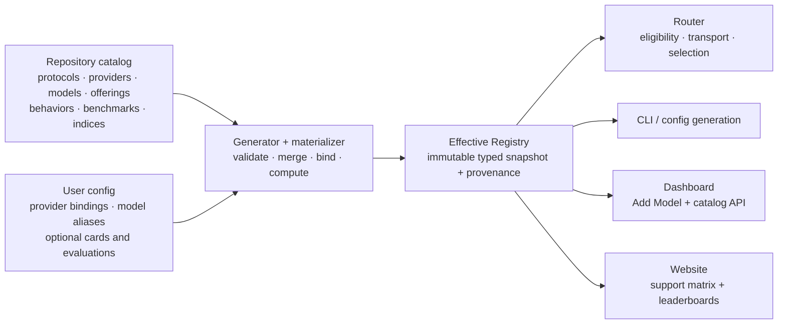

> **Status:** Implemented · **Created:** 2026-09-04

## Problem

vLLM Semantic Router currently describes model support in several independent
places:

- Router configuration owns logical model cards, backend bindings, pricing,
  API format, and operator-authored reasoning families;
- `pkg/config/helper.go` owns a second provider-type table for authentication and
  request paths;
- the Dashboard owns a separate provider-preset list and provider logos;
- the CLI built-in catalog owns only the packaged Mixture-of-Models virtual
  models and their recommended physical pools;
- selection, Looper, training, and Evaluation each interpret a scalar
  `quality_score` differently.

The result is not a coherent Day-0 support boundary. Adding a provider or model
can require synchronized edits across Go, Python, TypeScript, YAML, examples,
and tests, while the Dashboard can advertise a provider preset that the Router
does not support as a native provider type. A single quality number also hides
which benchmarks were measured, how they were normalized, and whether missing
data was silently treated as a poor result.

## Current baseline

The following inventory describes the repository before this implementation. The terms
are intentionally precise: a UI preset is not automatically a native adapter,
and a recommended model reference is not a complete built-in model card.

| Surface | Current built-in inventory | Meaning |
| --- | --- | --- |
| Router provider types | `openai`, `anthropic`, `azure-openai`, `bedrock`, `gemini`, `vertex-ai`, `minimax` | Seven runtime types with hard-coded auth and path defaults |
| Inbound/upstream protocol families | OpenAI Chat Completions, OpenAI Responses, Anthropic Messages | Protocol codecs and request paths implemented by the Router |
| Dashboard “Start here” presets | vLLM, SGLang, AMD ATOM, OpenAI Compatible | Four connection-form presets |
| Dashboard model API presets | OpenRouter, OpenAI, Anthropic, Google Gemini, DeepSeek, Groq, Together AI, Fireworks AI, Mistral AI, xAI, Cerebras, NVIDIA NIM, Perplexity, Cohere, DeepInfra, Hugging Face, SambaNova, DashScope, MiniMax, Moonshot AI, Z.ai, Novita AI, Nebius AI Studio, Featherless AI, FriendliAI, Vercel AI Gateway, CometAPI, Sakana AI | Twenty-eight UX presets, mostly using compatibility protocols |
| Dashboard private-runtime presets | Anthropic Compatible, Ollama, LM Studio, Xinference, NVIDIA Riva, NVIDIA Triton, Docker Model Runner, Lemonade | Eight UX presets |
| CLI built-in virtual models | `vllm-sr/mom-v1-blend`, `vllm-sr/mom-v1-lite`, `vllm-sr/mom-v1-flash`, `vllm-sr/mom-v1-ultra`, `vllm-sr/mom-v1-vault` | Five packaged virtual models |
| Recommended physical references | `local/qwen3.5-9b`, `local/qwen3.6-35b`, `local/step-3.7-flash`, `local/qwen3.5-122b`, `local/mistral-small-4`, `local/glm-5.2`, `local/gpt-oss-120b` | Seven pool recommendations, not yet full model cards |

The old Dashboard therefore contained 40 provider presets, while the Router
had seven hard-coded runtime types and the packaged catalog had no
general-purpose physical-model registry. The implemented catalog takes the
union of those identities and currently compiles 43 providers, three protocol
definitions, five virtual Model Cards, and ten benchmark definitions. Support
tier and conformance remain explicit, so inclusion is not flattened into a
native-support claim.

## Goals

1. Define one repository-owned catalog for protocols, providers, models,
   provider offerings, reasoning behavior, presentation metadata, benchmarks,
   and composite indices.
2. Generate Router, CLI, Dashboard, website, schema, and documentation views
   from the same validated source.
3. Keep ordinary user configuration short while preserving explicit,
   handwritten model cards for self-hosted and private models.
4. Replace ambiguous `quality_score` values with versioned measurements,
   reproducible index definitions, coverage, status, and provenance.
5. Make one model or provider Day-0 support change data-first, reviewable, and
   mechanically complete.
6. Preserve provider logos and improve the Dashboard Add Model flow without
   making catalog internals part of the user contract.

## Non-goals

- The catalog does not discover arbitrary internet models at Router startup.
- It does not turn provider compatibility into a claim of native semantic
  parity.
- It does not combine intelligence, latency, price, availability, and load into
  one opaque number. Those remain separate routing objectives.
- It does not redistribute third-party benchmark data without permission.
- It does not require every new model to have a composite score on release day.
  Missing evidence remains explicitly unavailable.
- This architecture change does not add a new physical model. The first
  representative physical-model Day-0 change is intentionally a separate PR.

## Design principles

- **One source, many views.** Catalog data is authored once and compiled into
  typed runtime and presentation artifacts.
- **Facts before defaults.** Protocol capabilities, model capabilities, and
  benchmark measurements remain distinct facts; defaults only select among
  them.
- **Intrinsic model versus provider offering.** Context, modalities, and model
  behavior belong to a model card. Endpoint paths, provider model IDs,
  availability, and prices belong to an offering.
- **Explicit identity.** Canonical catalog identity never depends on a
  request-facing alias.
- **Evidence is append-only by identity.** A new evaluation does not silently
  rewrite a previous measurement.
- **Unknown is not zero.** Missing, failed, unsupported, and not-applicable are
  different states.
- **Additive configuration, targeted cleanup.** The public contract remains
  `v0.3`. Catalog support is additive; only the ambiguous quality and reasoning
  fields, plus redundant names inside `providers.defaults`, are cleaned up.
- **Less configuration, not less control.** Built-in facts materialize
  automatically, while self-hosted models may still provide handwritten cards,
  reasoning behavior, evaluations, endpoint overrides, and pricing.

## Architecture



The build-time generator validates and joins repository resources into
committed projections. At runtime, the Go materializer merges those embedded
facts with user bindings and overlays into an immutable `EffectiveRegistry`.
CLI, Dashboard, and website projections are generated from the same snapshot;
none owns an independent provider or model inventory.

## Canonical catalog resources

| Resource | Owns | Does not own |
| --- | --- | --- |
| `ProtocolDefinition` | Versioned wire-format identity, declared operations and paths, and protocol capabilities | Provider credentials, model context limits, prices |
| `ProviderDefinition` | Canonical provider identity, auth, supported protocol-operation subset, path and non-secret header defaults, reasoning transport, support tier, conformance, display name, and logo metadata | Credentials, request-facing aliases, model intelligence |
| `ModelCard` | Canonical model identity, family/revision, release and knowledge dates, input/output limits, modalities, capabilities, reasoning behavior reference, lifecycle | Endpoint URL, credentials, provider price |
| `OfferingDefinition` | A provider/model pairing, provider model ID, supported protocols, parameter restrictions, lifecycle, verification, and optional dated pricing | Provider-independent model facts, endpoint credentials, routing alias |
| `ReasoningFamilyDefinition` | Request projection type/parameter plus effort vocabulary and default | Operator credentials, quality ranking |
| `BenchmarkDefinition` | Benchmark/version identity, domain, source, and metric direction/range/units | A model's result |
| `EvaluationRecord` | Exact model subject, raw measurements, date, status, source/artifact, provenance, verification, and redistribution permission | Aggregation policy |
| `IndexDefinition` | Versioned components, weights, normalization, missing-data policy, scale | Raw benchmark output |
| `IndexResult` | Computed score, domain subscores, coverage, per-component status/value, and source-record lineage | Mutable operator preference |

### Stable identities

- Provider IDs use stable slugs such as `openai` or `vllm`.
- Model-card names use namespaced IDs such as `organization/model-id`.
- Protocol, benchmark, and index identities include a version. Composite index
  versions use full semantic-version strings, for example
  `vllm-sr/intelligence@1.0.0`.
- An offering is keyed by `(provider, model, offering revision)` rather than by
  a display label.
- A model revision, quantization, runtime, and reasoning effort are part of an
  evaluation subject. Results from materially different subjects are not
  silently pooled.

## User-facing configuration

Catalog version, digest, the default composite-index ID, provenance internals,
and generated defaults are build/runtime metadata. They never appear in normal
user YAML. The public contract remains `version: v0.3` and retains the existing
`providers.defaults`, `providers.models`, `backend_refs`, and
`routing.modelCards` hierarchy.

### Built-in provider and model

A built-in model adds one optional `catalog` reference to the existing model
binding. `backend_refs[].provider` is the stable Provider ID. `api_format`
retains its existing values and remains an explicit override when needed.

```yaml
version: v0.3

providers:
  defaults:
    model: frontier
    reasoning_effort: medium
  models:
    - name: frontier
      catalog: vendor/reasoner-v1
      backend_refs:
        - name: primary
          provider: vendor-cloud
          api_key_env: VENDOR_API_KEY

routing:
  decisions:
    - name: default
      modelRefs:
        - model: frontier
```

The `vendor-cloud` and `vendor/reasoner-v1` values are illustrative, not support
claims. The identities are deliberately separate:

- `providers.models[].name` is the request-facing alias used by decisions;
- `providers.models[].catalog` is the canonical built-in Model Card identity;
- `backend_refs[].name` is only a local endpoint name;
- `backend_refs[].provider` is a repository Provider ID; omission retains the
  existing local-runtime shorthand and materializes as `vllm`.

The materializer joins those explicit references. It never joins two resources
because their `name` strings happen to match. No `deployment`,
`routing_overrides`, top-level `models`, or top-level `defaults` block is added.

### Handwritten override of a built-in card

Built-in cards materialize without `routing.modelCards`, but users may still
override allowed fields. The card's `name` equals
`providers.models[].catalog`, so the override target is visible:

```yaml
providers:
  models:
    - name: frontier
      catalog: vendor/reasoner-v1
      backend_refs:
        - name: primary
          provider: vendor-cloud
          api_key_env: VENDOR_API_KEY

routing:
  modelCards:
    - name: vendor/reasoner-v1
      description: Restricted production profile
      context_window_size: 128000
      capabilities: [chat, tools]
      tags: [production, approved]
```

The compiler loads built-ins first and applies typed overlays. Present scalar
fields replace, maps merge by key, and lists replace as a whole. Canonical
identity and bundled third-party evidence are immutable. Every effective field
retains `builtin` or `operator` provenance.

### Fully custom vLLM or SGLang model

`catalog` is optional. Without it, the model remains a normal self-hosted model
and the alias is also its local card identity. A card is optional for a minimal
chat model and may be handwritten whenever richer routing metadata is useful:

```yaml
providers:
  defaults:
    model: private-reasoner
    reasoning_effort: medium
  models:
    - name: private-reasoner
      provider_model_id: qwen3-custom-awq
      reasoning:
        family: qwen3
      backend_refs:
        - name: lab
          provider: vllm
          endpoint: model-gateway.example:8000/v1
          protocol: http
          api_key_env: LAB_VLLM_API_KEY

routing:
  modelCards:
    - name: private-reasoner
      description: Internal AWQ deployment
      context_window_size: 131072
      capabilities: [chat, tools, structured_output, reasoning]
      tags: [private, awq]
```

Custom models can reuse a built-in reasoning family as above, or define their
wire behavior inline:

```yaml
reasoning:
  type: chat_template_kwargs
  parameter: think_mode
  levels: [low, medium, high]
  default: medium
```

Built-in models need neither form; combining `catalog` with a per-model
`reasoning` block is rejected so a repository-owned reasoning contract cannot
silently diverge by alias. The old global
`providers.defaults.reasoning_families` registry and per-model
`reasoning_family` scalar are removed.

A metadata-only card whose name is a LoRA declared by a bound model remains
valid. It inherits that base model's provider bindings and is not interpreted
as a built-in catalog override. Any other card in a complete runtime config
must match either the model's `catalog` identity or, for a custom model, its
request alias.

### Optional custom evaluations

Evaluations are card metadata, so optional user-authored measurements live next
to the relevant handwritten card. The small surface has two required fields:

```yaml
routing:
  modelCards:
    - name: private-reasoner
      evaluations:
        - benchmark: idavidrein/gpqa-diamond@1.0.0
          metrics:
            pass_at_1: 0.72
        - benchmark: acme/support-bench@1
          metrics:
            resolution_rate: 0.82
          source: https://evals.example/runs/42
          measured_at: 2026-09-01
          metadata:
            runtime: vllm
            quantization: awq
```

`benchmark` is an explicit identity and `metrics` is an open numeric map, so
multi-metric benchmarks do not require another schema revision. `source`,
`measured_at`, and scalar `metadata` are optional. Users never configure a
nested evidence/provenance object.

Benchmark identities are namespaced and versioned (`owner/benchmark@1` or a
full semantic version). Metric names must be non-empty and values finite;
`measured_at`, when present, is an ISO calendar date. Metadata stays scalar so
the public surface does not grow a second evidence schema.

Known benchmark definitions supply ranges and direction; index definitions
select metrics and supply normalization. Namespaced unknown benchmarks are
retained and displayed but do not enter the default comparable index until a
definition is added to the repository catalog. No evaluation is required for
a custom model.

An unavailable score stays unavailable. Selection algorithms omit the quality
factor for that candidate and renormalize the remaining available factors; they
do not invent zero, a neutral score, or a parameter-size estimate.

## Protocol and backend API ownership

Backend API specifications live in the protocol registry, not in model-card
logos, provider forms, or scattered path constants. Initial definitions cover:

| Protocol | Operations owned by the definition | Examples of protocol semantics |
| --- | --- | --- |
| `openai/chat-completions@1` | `POST /v1/chat/completions`; `GET /v1/models` | Chat messages, streaming deltas, tools, usage, finish reasons |
| `openai/responses@1` | `POST /v1/responses`; `GET /v1/models` | Typed input/output items, tools, reasoning, and streaming events |
| `anthropic/messages@1` | `POST /v1/messages`; `GET /v1/models` | Messages/content blocks, tool use, usage, stop reasons |

A protocol operation defines the canonical method, path, and wire contract; it
does not claim that every provider implementing that protocol exposes every
operation. Each provider therefore declares an explicit, fully qualified
`supported_operations` subset such as
`openai/chat-completions@1#create`. Provider-specific paths are legal only for
declared operations. A provider definition also selects an auth strategy and
reusable request semantics such as reasoning transport. An offering narrows the
protocols a particular model supports and records model-specific parameter
restrictions.
Code adapters remain necessary only
for true semantic differences such as cloud signing, deployment-scoped URL
construction, event translation, or non-compatible error behavior.

`reasoning_transport` is internal catalog data, not user YAML. Its initial
reusable modes are `chat_template_kwargs`, `top_level_effort`, and
`deepseek_thinking`. Runtime dispatch selects these modes from the Provider ID;
it never infers provider behavior from an endpoint hostname.

This separates three questions that are currently conflated:

1. Can the Router decode and encode this protocol?
2. Can the provider transport that protocol correctly?
3. Does this model offering support this operation and parameter set?

## Replacing provider glue

The current provider-type registry in `pkg/config/helper.go` is migration
evidence, not the destination architecture. The final implementation replaces
it with four narrow seams:

1. **Compiled provider data** for base URL, auth strategy ID, default protocol,
   non-secret request headers, reasoning transport, presentation, and support
   tier.
2. **Transport resolver** for generic URL/path/header resolution.
3. **Auth strategy registry** for bearer, API-key header, cloud signing, and
   workload-identity behavior.
4. **Protocol/provider adapters** only where wire semantics genuinely differ.

No central switch grows when a data-only compatible provider is added. A new
adapter is registered beside its implementation and conformance fixtures, not
as another case in a generic config helper. Provider validation and runtime
defaults resolve through the embedded catalog. A small set of exported Go
constants remains only as source-compatibility conveniences for existing
callers; those constants are not the registry and do not grow for compatible
providers.

The same cut removes these steady-state duplicates:

- Dashboard `modelProviderCatalog.ts` as an independently maintained inventory;
- hand-maintained provider logos outside provider presentation metadata;
- operator-authored built-in reasoning families;
- model API format and request-path defaults spread across config helpers;
- scalar model quality fallbacks based on parameter count.

## Materialization pipeline

The compiler performs the following deterministic stages:

1. The build generator loads repository-owned protocol, provider, model,
   offering, reasoning, benchmark, evaluation, and index resources.
2. It validates JSON Schema plus canonical IDs, versions, references,
   uniqueness, URL safety, index weights, normalization parameters, and cycles.
3. It computes built-in index results and emits byte-identical Go, CLI,
   Dashboard, and website projections guarded by a generated-diff check.
4. The Router loads the embedded snapshot and then reads
   `providers.models` aliases/backend references, optional
   `routing.modelCards` overlays/custom cards, and optional evaluations from
   the v0.3 hierarchy.
5. The materializer applies presence-aware field overlays while retaining
   `builtin`/`operator` field provenance.
6. It joins every alias to one card and each backend binding to one Provider ID,
   protocol, optional offering, auth strategy, and reasoning behavior.
7. It validates user measurement ranges and computes repository-defined indices
   whose missing-data policy is satisfied.
8. It publishes one immutable `EffectiveRegistry` to Router runtime consumers;
   generated product projections continue to use the same validated snapshot.

Failures are path-specific. Unknown references, duplicate IDs, cycles, invalid
weights/normalizations, out-of-range metrics, unsupported protocol bindings,
and invalid built-in overrides fail generation or startup before traffic starts.

## Evaluation data model

### Benchmark definitions

Each metric declares its unit, valid range, and direction independently:

```yaml
- id: terminal-bench/terminal-bench@2.1.0
  display_name: Terminal-Bench v2.1
  domain: coding
  metrics:
    - id: pass_at_1
      unit: proportion
      range: [0, 1]
      direction: higher_is_better
```

Metric IDs are stable only within a benchmark version. Changing a dataset,
grader, prompt protocol, aggregation rule, or material harness behavior requires
a new benchmark version.

### Evaluation records

An evaluation record freezes the canonical model, raw versioned metric IDs and
values, status, measurement date, and evidence. Its typed subject can record
model revision, offering, runtime/version, quantization, precision, tensor
parallelism, protocol, reasoning effort, and additional material parameters.
Evidence records provenance, verification, optional source/artifact, and an
explicit redistribution decision.

Provenance is one of `vendor_claimed`, `third_party`, `vllm_sr_reproduced`, or
`operator`. Verification is separately recorded as `claimed`, `imported`, or
`reproduced`. Conflicting available values for the same model and metric are
rejected rather than resolved through a hidden preference rule. Source record
IDs remain attached to computed results.

### Index definitions

An index is a pure, versioned calculation over metrics or other indices:

```yaml
- id: example/index@1.0.0
  display_name: Example Index
  description: Example auditable composite.
  scale: [0, 100]
  aggregation: weighted_mean
  missing:
    policy: require_coverage
    minimum: 0.80
  components:
    - metric: benchmark-a@1.0.0#accuracy
      weight: 0.60
      normalization:
        type: identity
    - metric: benchmark-b@2.0.0#error_rate
      weight: 0.40
      normalization:
        type: one_minus
```

Supported normalization primitives are deliberately small and auditable:
`identity`, `one_minus`, `linear_clamp`, `piecewise_linear`, `logistic`, and
`lookup`. The compiler verifies component weights, metric ranges, directions,
references, and cycles.

Supported missing-data policies are:

- `require_all`: unavailable unless every component exists;
- `require_coverage`: available only above an explicit weight threshold;
- `reported_only`: descriptive result over reported components, never eligible
  for the default comparable leaderboard.

For an explicitly permitted partial result:

```text
coverage = sum(weight of present components)
score = 100 * sum(weight * normalized value) / coverage
```

Every `IndexResult` contains `score`, `status`, `coverage`, domain subscores,
component status/value/normalized value, and source record IDs. A score of zero
is therefore distinguishable from an unavailable score.

## Default intelligence index

The default model-intelligence algorithm is
`vllm-sr/intelligence@1.0.0`, derived from the publicly documented
[Artificial Analysis Intelligence Index v4.1.1 methodology](https://artificialanalysis.ai/methodology/intelligence-benchmarking).
It is a model-quality index, not an efficiency or routing-utility score.

| Domain | Component | Weight | Normalization |
| --- | --- | ---: | --- |
| Agents | GDPval-AA v2 | 20% | `clamp((Elo - 500) / 2000, 0, 1)` |
| Agents | τ³-Banking | 14% | Identity on a validated 0–1 result |
| Coding | Terminal-Bench v2.1 | 16% | Identity on a validated 0–1 result |
| Coding | SciCode | 8% | Identity on a validated 0–1 result |
| General | AA-LCR | 6% | Identity on a validated 0–1 result |
| General | AA-Omniscience accuracy | 8% | Identity on a validated 0–1 result |
| General | AA-Omniscience non-hallucination rate | 4% | Identity on a validated 0–1 result |
| Scientific reasoning | Humanity's Last Exam | 12% | Identity on a validated 0–1 result |
| Scientific reasoning | GPQA Diamond | 6% | Identity on a validated 0–1 result |
| Scientific reasoning | CritPt | 6% | Identity on a validated 0–1 result |

The weights total 100%. The published methodology groups those components into
Agents 34%, Coding 24%, General 18%, and Scientific Reasoning 24%; vLLM-SR
retains the same groups for its per-domain diagnostic display:

```text
intelligence = 100 * (
    0.20 * normalize(gdpval_aa_v2_elo)
  + 0.14 * tau3_banking
  + 0.16 * terminal_bench_v2_1
  + 0.08 * scicode
  + 0.06 * aa_lcr
  + 0.08 * aa_omniscience_accuracy
  + 0.04 * aa_omniscience_non_hallucination
  + 0.12 * humanitys_last_exam
  + 0.06 * gpqa_diamond
  + 0.06 * critpt
)
```

The built-in default uses `require_all` for the comparable headline score.
Models without all components display `Not yet measured`; domain and component
availability remains explicit in the generated result. Alternative index
definitions are repository catalog extensions rather than ordinary user-config
knobs.

An official third-party composite, when lawfully retrieved, is stored under a
separate identity such as
`external/artificial-analysis/intelligence@4.1.1`. A locally computed
vLLM-SR result is not labeled as an official external score. The
[Artificial Analysis data API documentation](https://artificialanalysis.ai/data-api/docs)
is the integration contract for authorized imports; null values remain null,
and attribution and redistribution terms are enforced. The open-source catalog
must not scrape or bulk-copy restricted benchmark data.

Future multilingual and multimodal indices remain separate because their task
and coverage definitions differ from the default text intelligence index.
Price, latency, throughput, time to first token, and availability remain
separate routing signals and are never folded into intelligence.

## Replacing `quality_score`

The migration removes the bare scalar rather than assigning it a new meaning:

| Current behavior | Replacement |
| --- | --- |
| `routing.modelCards[].quality_score` | `routing.modelCards[].evaluations[]`, then a computed built-in `IndexResult` |
| MMLU-Pro average written directly into `quality_score` | Versioned MMLU-Pro `EvaluationRecord` |
| Multi-factor selection reads one static scalar | `ScoreResolver(model, index)` returns value, coverage, status, and provenance |
| Looper estimates quality from parameter count | Removed; missing evidence follows routing policy |
| Session-aware hard-coded fallback | Removed; missing evidence is explicit |
| Online learned quality shares the same name | Separate `ObservedQuality` runtime signal with window and sample count |
| Evaluation report chooses one available number as quality | Explicit `primary_metric {id, value, unit, confidence_interval}` |

The release's default index is internal catalog policy and is not serialized
into user YAML. Selection uses it only when candidates have comparable results.
For a missing result, the quality factor is omitted and the remaining available
factors are renormalized. An operator rating can be represented explicitly as
`vllm-sr/operator-rating@1.0.0`, but it is not presented as public benchmark
evidence and does not enter the public default leaderboard.

## Dashboard experience

The Add Model workflow keeps provider cards and logos. Its data source changes:

1. Provider cards, categories, descriptions, auth fields, default URLs, logos,
   and protocol badges come from provider catalog presentation metadata.
   The browser submits only the Provider ID with connection input; the backend
   resolves model-inventory paths, auth header/prefix, and safe default headers
   from the same registry. There is no UI-owned `authMode` switch.
   The **List models** action appears only when the provider explicitly declares
   the default protocol's `list_models` operation; manual model-ID entry remains
   available for every provider.
2. Selecting a provider filters compatible model offerings and shows whether
   support is native, compatible, runtime-hosted, experimental, or deprecated.
3. Selecting a built-in model saves `providers.models[].catalog`, pre-fills
   provider model ID when an offering supplies one, and does not emit generated
   Model Card defaults.
4. Selecting Custom omits `catalog` and exposes the existing handwritten
   `routing.modelCards` fields, including optional evaluations and custom
   reasoning.
5. The model inventory labels built-in versus Custom identity and lets an
   operator intentionally edit a generated card override.
6. The saved YAML contains only the existing provider/model bindings,
   credential references, `catalog` when selected, and intentional overrides.
   It does not contain catalog digest, index identity, or generated defaults.

Logo metadata includes a repository/package asset or approved external source,
a monogram fallback, and monochrome behavior. The UI always falls back to the
monogram, so a missing image never blocks model configuration. External assets
remain subject to the repository's normal attribution and redistribution
review rather than adding that policy to user configuration.

## Website model catalog and leaderboard

Add a public **Models** page generated from a sanitized catalog snapshot. It has
three connected views:

### Provider support matrix

Columns include provider identity, support tier, category, auth strategy,
supported protocol operations, conformance status, and last verification date.
Compatibility presets are labeled as such rather than presented as native
adapters. Presentation metadata still drives the richer Dashboard cards; the
website uses the provider monogram in its dense table.

### Built-in model table

Columns include canonical model name, kind, context limit, capabilities,
reasoning family, offering count, default-index score, and coverage. Virtual
and physical models are searchable, filterable, and visually distinct.

### Leaderboards

The built-in table ranks comparable models by
`vllm-sr/intelligence@1.0.0` and renders missing/not-applicable results as
`Not yet measured`, not zero. It exposes the headline value and coverage. A
methodology panel shows the full index identity, aggregation, scale,
missing-data policy, source methodology, component metric IDs, and weights.
The generated snapshot additionally retains domain subscores, per-component
values/status, and evaluation-record lineage for future presentation views.

The current UI filters providers by tier and models by kind, with search on
both tables. The generator fails on unresolved references, invalid scores or
normalizations, unsafe URLs, stale generated output, or publication of records
without redistribution permission.

The website and Dashboard consume the same generated snapshot; neither owns a
parallel provider or model list.

## Day-0 model support workflow

A model-only support change follows one bounded sequence:

1. **Source packet:** link primary model/API documentation and record release,
   model revision, limits, modalities, capabilities, protocols, parameter
   restrictions, pricing date, and lifecycle.
2. **Model card:** add or update one canonical card. Do not copy endpoint,
   price, or provider-only facts into it.
3. **Offerings:** add every verified provider/model offering with provider model
   ID, protocols, parameter constraints, pricing when known, and evidence.
4. **Reasoning behavior:** reference an existing built-in family or add a new
   family with per-protocol request-shaping fixtures. Users do not re-declare it.
5. **Adapters:** add code only for a true wire-semantic difference. Compatible
   offerings remain data-only.
6. **Conformance fixtures:** cover accepted and rejected parameters, tools,
   streaming, usage, error translation, model-ID projection, and every claimed
   protocol operation.
7. **Evaluation:** add lawful raw measurements with complete subject and
   provenance. Compute the default index only when its coverage policy passes;
   otherwise publish `Not yet measured`.
8. **Generated surfaces:** regenerate the embedded Go registry, CLI bundles,
   Dashboard snapshot, and website snapshot. No manual frontend row is added.
9. **Examples and docs:** add a minimal provider/model config and update the
   generated support matrix.
10. **Validation:** run schema/compiler, generated-diff, unit, protocol,
    Dashboard, website, and affected E2E gates selected by the harness.

A Day-0 PR is complete only when runtime claims, UI presentation, docs, and
tests are derived from the same entry. A score is optional; falsifying one is
not.

## New provider support workflow

Provider work is a superset of model work:

1. add provider identity, presentation, support tier, auth strategy, transport
   and non-secret header defaults, and source evidence;
2. bind supported protocols and their exact operation subsets, then implement an
   adapter only when compatibility is insufficient;
3. add auth, URL construction, error, streaming, and protocol conformance
   fixtures;
4. add verified model offerings;
5. regenerate Dashboard, website, CLI, and runtime registry projections;
6. verify that provider removal or deprecation is visible and fails safely.

This single schema replaces the current split among the provider endpoint
support matrix, provider registry, Add Model creation fields, and public
Provider API. The runtime materializer, Dashboard discovery endpoint, generated
website tables, and CLI projection all consume the same provider identity and
protocol-operation graph.

## Support and evidence states

The generated surfaces use independent fields instead of one overloaded
“supported” boolean:

| Dimension | Values |
| --- | --- |
| Provider integration | `native`, `compatible`, `runtime` |
| Lifecycle | `experimental`, `active`, `deprecated`, `removed` |
| Conformance | `unverified`, `fixture_verified`, `live_verified` |
| Evaluation provenance | `vendor_claimed`, `third_party`, `vllm_sr_reproduced`, `operator` |
| Evaluation status | `available`, `missing`, `failed`, `not_applicable`, `withheld` |

“Built-in model” means the release contains a validated `ModelCard` and at least
one offering or packaged virtual-model binding. A string mentioned in a
recommended pool is not built-in until it satisfies that contract.

## Configuration migration

The target remains `version: v0.3`; there is no new level hierarchy and no
dual v0.3/v0.4 runtime parser. The catalog is additive, with four intentional
field cleanups:

| Previous v0.3 field | Final v0.3 field or behavior |
| --- | --- |
| `providers.defaults.default_model` | `providers.defaults.model` |
| `providers.defaults.default_reasoning_effort` | `providers.defaults.reasoning_effort` |
| `providers.defaults.reasoning_families` + `providers.models[].reasoning_family` | Built-in family from `catalog`, or local `providers.models[].reasoning` |
| `routing.modelCards[].quality_score` | `routing.modelCards[].evaluations[]` |
| `backend_refs[].type` / free-form provider spelling | `backend_refs[].provider` using a catalog Provider ID |

`api_format: openai|responses|anthropic`, `provider_model_id`, pricing,
reliability, endpoint fields, decision model aliases, and the surrounding
hierarchy remain valid. The explicit migration command rewrites only the fields
above. A legacy scalar becomes a `vllm-sr/operator-rating@1.0.0` evaluation so
it is not misrepresented as a public benchmark result. Steady-state loading
rejects the retired fields after migration.

## Repository layout and ownership

The implementation should use narrow source modules rather than extending
existing hotspots:

```text
config/catalog/
  catalog.yaml      # versioned source manifest and resource file list
  schemas/          # source, resource, and generated-snapshot schemas
  resources/        # provider, protocol, model, offering, reasoning, evaluation, index data

src/semantic-router/pkg/catalog/
  compiler.go       # merge, binding, and field provenance
  registry.go       # immutable built-in/effective lookup views
  scoring.go        # validation, normalization, and index computation
  zz_generated_catalog.go

tools/catalog/
  generate_model_catalog.py  # graph validation and all generated projections

dashboard/backend/handlers/
  model_catalog.go + model_catalog_contract.go

website/
  static/model-catalog/catalog.json + src/pages/models.tsx
```

`pkg/config` consumes the compiled result; it does not own the catalog.
Protocol and provider adapters remain in narrow runtime packages.

## Delivery phases

| Phase | Implemented deliverable | Completion criterion |
| --- | --- | --- |
| 1 | Resource schemas, source layout, generator, embedded registry, provenance, and generated-diff gate | Invalid catalogs fail deterministically; one graph emits every projection |
| 2 | v0.3 config materializer and targeted migration command | Built-in and handwritten cards produce one `EffectiveRegistry` |
| 3 | Catalog-backed protocol/provider/auth/path resolution | Data-only providers require no config-helper switch or Dashboard row |
| 4 | Evaluation records, default intelligence index, score resolver, and typed runtime primary metric | Bare static/runtime `quality_score` and parameter-size fallbacks are removed |
| 5 | Dashboard catalog API/Add Model migration and website Models page | Logos/forms and public support/ranking tables consume generated data |
| 6 | Day-0 contributor guide and repository gates | A compatible model/provider change has one authored source path |

The architecture PR deliberately contains no new physical model. A separate
follow-up adds one representative model as the reviewable Day-0 example.

## Acceptance criteria

- One canonical resource graph produces Router, CLI, Dashboard, and website
  views.
- `providers.models[].catalog` resolves to a built-in or handwritten
  `routing.modelCards[].name`; request aliases never act as built-in card
  identities.
- Users can override a built-in card or fully define a custom vLLM/SGLang card.
- Built-in reasoning behavior and provider API operations need no repeated user
  configuration.
- Catalog versions and digests stay out of ordinary YAML.
- Provider logos remain visible and are catalog-managed.
- The public support matrix differentiates native, compatible, and runtime
  integrations.
- The default intelligence index is versioned, reproducible, and exposes all
  components, coverage, status, and evaluation-record provenance.
- Missing evaluation data is never converted to zero.
- Intelligence, cost, latency, throughput, load, and availability remain
  separately selectable routing objectives.
- A model Day-0 PR updates one catalog source and generated views, adds the
  evidence appropriate to its claims, and passes the affected gates.
- The old provider registry, independent Dashboard preset list, static quality
  fallbacks, and duplicate reasoning-family configuration are removed without
  changing the v0.3 document hierarchy.

## Resolved decisions

- The field is named `catalog`, not `catalog_ref`.
- `providers.models[].name` is a request-facing alias;
  `providers.models[].catalog` is a canonical Model Card identity.
- `routing.modelCards[].name` is that same canonical identity for a built-in
  override, or the local alias for a model without `catalog`.
- Model cards remain optional for built-ins and supported for custom models.
- `deployment` and `routing_overrides` are not added.
- Built-in reasoning families are automatic; custom runtimes can select or
  define reasoning under their own model binding.
- Backend API specifications are protocol definitions plus offering
  constraints, not provider-form conditionals.
- The Dashboard Add Model experience and logos remain, backed by generated
  catalog data.
- The default quality headline is an evidence-backed, versioned intelligence
  index stored internally; neither it nor a generic scalar `quality_score`
  appears in ordinary user YAML.
- The website publishes built-in support and rankings from the same sanitized
  catalog snapshot used by the Dashboard.

## References

- [Artificial Analysis Intelligence Benchmarking Methodology](https://artificialanalysis.ai/methodology/intelligence-benchmarking)
- [Artificial Analysis Models](https://artificialanalysis.ai/models)
- [Artificial Analysis Data API](https://artificialanalysis.ai/data-api/docs)
- [Unified Config Contract v0.3](./unified-config-contract-v0-3)
- [Multi-Protocol Adapter Architecture](./multi-protocol-adaptor)
- [Evaluation Plane](../benchmarking/evaluation-plane)
