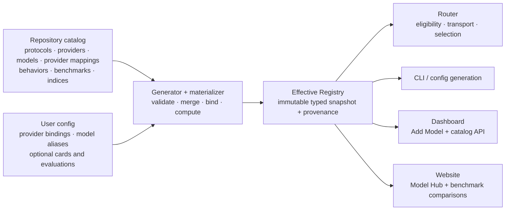

> **Status:** Implemented · **Created:** 2026-09-04

## Problem

vLLM Semantic Router currently describes model support in several independent
places:

- Router configuration owns logical model cards, backend bindings, pricing,
  API format, and operator-authored reasoning families;
- `pkg/config/helper.go` owns a second provider-type table for authentication and
  request paths;
- the Dashboard owns a separate provider-preset list and provider logos;
- the CLI built-in catalog owns only the packaged Mixture-of-Models virtual
  models and their recommended physical pools;
- selection, Looper, training, and Evaluation each interpret a scalar
  `quality_score` differently.

The result is not a coherent Day-0 support boundary. Adding a provider or model
can require synchronized edits across Go, Python, TypeScript, YAML, examples,
and tests, while the Dashboard can advertise a provider preset that the Router
does not support as a native provider type. A single quality number also hides
which benchmarks were measured, how they were normalized, and whether missing
data was silently treated as a poor result.

## Current baseline

The following inventory describes the repository before this implementation. The terms
are intentionally precise: a UI preset is not automatically a native adapter,
and a recommended model reference is not a complete built-in model card.

| Surface | Current built-in inventory | Meaning |
| --- | --- | --- |
| Router provider types | `openai`, `anthropic`, `azure-openai`, `bedrock`, `gemini`, `vertex-ai`, `minimax` | Seven runtime types with hard-coded auth and path defaults |
| Inbound/upstream protocol families | OpenAI Chat Completions, OpenAI Responses, Anthropic Messages | Protocol codecs and request paths implemented by the Router |
| Dashboard “Start here” presets | vLLM, SGLang, AMD ATOM, OpenAI Compatible | Four connection-form presets |
| Dashboard model API presets | OpenRouter, OpenAI, Anthropic, Google Gemini, DeepSeek, Groq, Together AI, Fireworks AI, Mistral AI, xAI, Cerebras, NVIDIA NIM, Perplexity, Cohere, DeepInfra, Hugging Face, SambaNova, DashScope, MiniMax, Moonshot AI, Z.ai, Novita AI, Nebius AI Studio, Featherless AI, FriendliAI, Vercel AI Gateway, CometAPI, Sakana AI | Twenty-eight UX presets, mostly using compatibility protocols |
| Dashboard private-runtime presets | Anthropic Compatible, Ollama, LM Studio, Xinference, NVIDIA Riva, NVIDIA Triton, Docker Model Runner, Lemonade | Eight UX presets |
| CLI built-in virtual models | `vllm-sr/mom-v1-blend`, `vllm-sr/mom-v1-lite`, `vllm-sr/mom-v1-flash`, `vllm-sr/mom-v1-ultra`, `vllm-sr/mom-v1-vault` | Five packaged virtual models |
| Recommended physical references | `local/qwen3.5-9b`, `local/qwen3.6-35b`, `local/step-3.7-flash`, `local/qwen3.5-122b`, `local/mistral-small-4`, `local/glm-5.2`, `local/gpt-oss-120b` | Seven pool recommendations, not yet full model cards |

The old Dashboard therefore contained 40 provider presets, while the Router
had seven hard-coded runtime types and the packaged catalog had no
general-purpose physical-model registry. The implemented snapshot compiles 60
serving providers, three protocol definitions, 83 physical Model Cards, five
virtual Model Cards, 166 provider-owned model mappings, 60 benchmark
definitions, and 1,285 exact evaluation records. The five default benchmark
components produce 1,315 explicit slots over 263 model/effort rows; 116 slots
are currently measured and every other slot stays explicitly missing. Support
tier, lifecycle, and conformance remain independent, so catalog inclusion is
not flattened into a native-support or benchmark claim.

All 83 physical cards pass the hard admission rule: at least one exact
model, reasoning-effort, and evidence-provenance bucket contains five distinct
benchmark identities.
That does not mean every runtime-selectable effort has five published results.
Across 180 selectable effort levels, 105 currently have at least five
benchmarks, four are partial, and 71 are unmeasured. The audit exposes those
three states and offers a stricter selectable-effort gate for future data work;
the current release keeps the gaps visible instead of copying a score from
another effort or deleting a valid runtime control. Conditions recorded for a
model without a `reasoning_family` are evidence labels, not configurable
Dashboard controls.

### Implemented physical-model catalog

The initial physical catalog is curated by **model creator**, not by taking the
first 20 individual models from any ranking or endpoint inventory. It focuses
on roughly twenty mainstream creator companies (22 in this snapshot) and represents roughly their latest three
generations or product lines. Closely related sizes or reasoning variants are
included only when they are separately selectable and materially useful to
operators. GPT-6 Astra remains intentionally absent for the separate Day-0
example change.

| Model creator (`publisher`) | Recent generations and representative lines | Models |
| --- | --- | ---: |
| AI21 Labs | Jamba2 Mini, Jamba Reasoning 3B, Jamba Large 1.7 | 3 |
| Alibaba / Qwen | Qwen3.8 Max/27B/2.4T, Qwen3.7 Max, Qwen3.6 27B/35B | 6 |
| Amazon | Nova 2 Lite, Nova Premier, Nova Pro | 3 |
| Anthropic | Claude Fable 5.1/5, Opus 5/4.8, Sonnet 5 | 5 |
| Baidu | ERNIE 5.1, ERNIE 5.0, ERNIE 4.5 300B A47B | 3 |
| ByteDance / Seed | Seed2.1 Pro/Turbo, Seed2.0 Pro, Seed OSS 36B | 4 |
| Cohere | North Mini Code, Command A+, Tiny Aya Global | 3 |
| DeepSeek | DeepSeek V4 Pro/Flash, V3.2, R1 | 4 |
| Google | Gemini 3.8/3.7/3.6 Flash, Gemma 4 31B | 4 |
| Meta | Muse Spark 1.3/1.2, Muse Glimmer, Llama 4 Maverick/Scout | 5 |
| Microsoft | MAI-Thinking-1, Phi-4 Reasoning Vision, Phi-4 Mini Flash Reasoning | 3 |
| MiniMax | M3, M2.7, M2.5 | 3 |
| Mistral AI | Small 4, Medium 3.5, Large 3 | 3 |
| Moonshot / Kimi | Kimi K3, K2.7 Code, K2.6, K2.5 | 4 |
| NVIDIA | Nemotron 3.5 Lightning, Nemotron 3 Ultra/Super/Nano Omni, Cascade 2 | 5 |
| OpenAI | GPT-5.6 Sol/Terra/Luna, GPT-5.5, GPT-5.4, GPT-OSS 120B/20B | 7 |
| StepFun | Step 3.7 Flash, Step 3.5 Flash, Step3-VL 10B | 3 |
| Tencent / Hunyuan | Hy4 Preview, Hy3, Hunyuan A13B | 3 |
| Thinking Machines Lab | Inkling, Inkling Small | 2 |
| Xiaomi | MiMo V2.5 Pro/V2.5, MiMo V2 Flash | 3 |
| Z.ai / GLM | GLM-5.3/5.3 Flash, GLM-5.2, GLM-5.1 | 4 |
| xAI | Grok 4.6, 4.5, 4.3 | 3 |

Each creator owns one focused file under `resources/models/single/`; physical
evaluation records use the corresponding creator file under
`resources/evaluations/single/`. Recipe-backed logical models stay in
`models/virtual/` and their recipe-run evaluations stay in
`evaluations/virtual/`, so physical and virtual identities never share an
inventory file.

This creator curation is deliberately independent from serving-provider
coverage. `ProviderDefinition` describes a runtime endpoint contract, so the
60-provider registry remains broad enough to power Add Model and custom-model
connections even when a provider has no curated built-in Model Card mapping.
Conversely, `ModelCard.publisher` names the company that created the model; it
does not name every cloud, gateway, or self-hosted runtime that can serve it.

A separately selectable model or checkpoint gets one canonical card. A dated
provider snapshot, batch SKU, quantization, or alias stays on the provider
mapping or evaluation subject unless the creator defines it as a materially
distinct model. The baseline favors depth and current relevance within the
reviewed creator companies over a shallow long tail of lesser-known creators. Future
admission updates the relevant creator file and normally keeps the latest three
generations or representative lines, while historical entries can be removed
or deprecated according to lifecycle policy.

This boundary is executable but internal. The source manifest contains an
`inventory.physical` policy with the reviewed creator allowlist, explicit
current representative model IDs, a default minimum of three, and exceptions
such as Thinking Machines Lab while it has only two public product lines.
Generation rejects unlisted physical creators, missing representative IDs, and
insufficient current depth. The policy
is omitted from generated runtime snapshots and never appears in user YAML;
reviewers, rather than a timestamp heuristic, decide whether a line is recent
and representative.

## Goals

1. Define one repository-owned catalog for protocols, providers, models,
   provider-owned model mappings, reasoning behavior, presentation metadata,
   benchmarks, and optional internal indices.
2. Generate Router, CLI, Dashboard, website, schema, and documentation views
   from the same validated source.
3. Keep ordinary user configuration short while preserving explicit,
   handwritten model cards for self-hosted and private models.
4. Replace ambiguous `quality_score` values with versioned measurements,
   deterministic index definitions, coverage, status, and provenance.
5. Make one model or provider Day-0 support change data-first, reviewable, and
   mechanically complete.
6. Preserve provider logos and improve the Dashboard Add Model flow without
   making catalog internals part of the user contract.

## Non-goals

- The catalog does not discover arbitrary internet models at Router startup.
- It does not turn provider compatibility into a claim of native semantic
  parity.
- It does not combine intelligence, latency, price, availability, and load into
  one opaque number. Those remain separate routing objectives.
- It does not publish an overall model ranking. Public comparisons are scoped
  to one exact benchmark version, profile, and metric; each bar is one labeled
  model-and-reasoning-effort record.
- It does not require every new model to have a composite score on release day;
  missing evidence remains explicitly unavailable.
- GPT-6 Astra is intentionally excluded. It is the separate representative
  Day-0 contribution after this architecture and baseline-catalog change.

## Design principles

- **One source, many views.** Catalog data is authored once and compiled into
  typed runtime and presentation artifacts.
- **Facts before defaults.** Protocol capabilities, model capabilities, and
  benchmark measurements remain distinct facts; defaults only select among
  them.
- **Intrinsic model versus provider-owned model mapping.** Context,
  modalities, and model behavior belong to a model card. Endpoint paths,
  provider-native model IDs, availability, and prices belong to that
  provider's `models[]` entry.
- **Explicit identity.** Canonical catalog identity never depends on a
  request-facing alias.
- **Evidence is append-only by identity.** A new evaluation does not silently
  rewrite a previous measurement.
- **Unknown is not zero.** Missing, failed, unsupported, and not-applicable are
  different states.
- **Additive configuration, targeted cleanup.** The public contract remains
  `v0.3`. Catalog support is additive; only the ambiguous quality and reasoning
  fields, plus redundant names inside `providers.defaults`, are cleaned up.
- **Less configuration, not less control.** Built-in facts materialize
  automatically, while self-hosted models may still provide handwritten cards,
  reasoning behavior, evaluations, endpoint overrides, and pricing.

## Architecture



The build-time generator validates and joins repository resources into
committed projections. At runtime, the Go materializer merges those embedded
facts with user bindings and overlays into an immutable `EffectiveRegistry`.
CLI, Dashboard, and website projections are generated from the same snapshot;
none owns an independent provider or model inventory.

## Canonical catalog resources

| Resource | Owns | Does not own |
| --- | --- | --- |
| `ProtocolDefinition` | Versioned wire-format identity, declared operations and paths, and protocol capabilities | Provider credentials, model context limits, prices |
| `ProviderDefinition` | Stable runtime API contract, auth, supported protocol-operation subset, path and non-secret header defaults, reasoning transport, support tier, conformance, display name, logo metadata, and its `models[]` native-ID/protocol/restriction/pricing mappings | Creator identity, credentials, request-facing aliases, intrinsic model intelligence |
| `CatalogModelBinding` | One model-to-serving-channel mapping, including native ID, protocols, restrictions, pricing, and the explicit `first_party`, `managed_cloud`, `gateway`, or `self_hosted` relationship | Endpoint credentials, request-facing aliases, intrinsic model facts |
| `ModelCard` | Canonical model identity, creator in `publisher`, presentation/distribution, family/revision, release and knowledge dates, input/output limits, modalities, capabilities, reasoning behavior reference, lifecycle | Endpoint URL, credentials, serving-provider price |
| `ReasoningFamilyDefinition` | Request projection type/parameter plus effort vocabulary and default | Operator credentials, benchmark comparison |
| `BenchmarkDefinition` | Benchmark/version identity, domain, source, and metric direction/range/units | A model's result |
| `EvaluationRecord` | Exact model subject, raw measurements, optional measurement date, status, source/artifact, provenance, and verification | Aggregation policy |
| `IndexDefinition` | Versioned components, weights, normalization, missing-data policy, scale | Raw benchmark output |
| `IndexResult` | Computed score, domain subscores, coverage, per-component status/value, and source-record lineage | Mutable operator preference |

### Stable identities

- Provider IDs use stable slugs such as `openai` or `vllm`.
- Model-card names use namespaced IDs such as `organization/model-id`.
- `ModelCard.publisher` identifies the creator company. It is intentionally
  independent from the Provider IDs that can serve the model.
- Protocol, benchmark, and index identities include a version. Composite index
  versions use full semantic-version strings, for example
  `vllm-sr/intelligence@1.0.0`.
- A provider-owned model mapping is addressed by the Provider ID plus canonical
  Model Card identity and provider-native model ID, never by a display label.
- Every built-in mapping declares its relationship to the model creator:
  `first_party` for a creator-owned API or creator cloud route,
  `managed_cloud` for a third-party cloud-hosted offering, `gateway` for an
  intermediary model gateway, and `self_hosted` for a local/private runtime.
  This repository-owned classification is independent from ProviderDefinition
  `category` and `support_tier` and never enters user YAML.
- A model revision, quantization, runtime, and reasoning effort are part of an
  evaluation subject. Results from materially different subjects are not
  silently pooled.
- A virtual model role's `recommended_pool` is not a foreign-key relation. It
  may recommend a built-in Model Card or an operator-defined model that only
  exists in deployment configuration.

## User-facing configuration

Catalog version, digest, the default composite-index ID, provenance internals,
generated defaults, and model-binding relationship classifications are
build/runtime metadata. They never appear in normal user YAML. The public
contract remains `version: v0.3` and retains the existing
`providers.defaults`, `providers.models`, `backend_refs`, and
`routing.modelCards` hierarchy.

### Built-in provider and model

A built-in model adds one optional `catalog` reference to the existing model
binding. `backend_refs[].provider` is the stable Provider ID. `api_format`
retains its existing values and remains an explicit override when needed.

```yaml
version: v0.3

providers:
  defaults:
    model: frontier
  models:
    - name: frontier
      catalog: vendor/reasoner-v1
      backend_refs:
        - name: primary
          provider: vendor-cloud
          api_key_env: VENDOR_API_KEY

routing:
  decisions:
    - name: default
      modelRefs:
        - model: frontier
```

The `vendor-cloud` and `vendor/reasoner-v1` values are illustrative, not
support claims. The identities are deliberately separate:

- `providers.models[].name` is the request-facing alias used by decisions;
- `providers.models[].catalog` is the canonical built-in Model Card identity;
- `backend_refs[].name` is only a local endpoint name;
- `backend_refs[].provider` is a repository Provider ID; omission retains the
  existing local-runtime shorthand and materializes as `vllm`.

The materializer joins those explicit references. It never joins two resources
because their `name` strings happen to match. No `deployment`,
`routing_overrides`, top-level `models`, or top-level `defaults` block is added.
When `providers.defaults.reasoning_effort` is omitted, the selected model's
reasoning-family default wins; canonical export does not synthesize or write
back a global effort that the user did not configure.

Multiple `backend_refs` under one alias form one Envoy load-balancing pool, so
they must be homogeneous replicas. They may vary in network target and weight,
but must resolve to the same Provider ID, wire protocol, native model ID,
credential source, auth convention, effective headers, base/request path,
reasoning transport, and compatible DNS/TLS semantics. Envoy selects the
physical endpoint after the Router has selected one provider profile; mixing
those request semantics would otherwise send the first backend's metadata to a
different upstream. Materialization therefore fails clearly instead of
silently using the first backend. A genuinely different provider, credential,
path, or TLS origin is a separate model alias and is routed explicitly.

### Handwritten override of a built-in card

Built-in cards materialize without `routing.modelCards`, but users may still
override allowed fields. The card's `name` equals
`providers.models[].catalog`, so the override target is visible:

```yaml
providers:
  models:
    - name: frontier
      catalog: vendor/reasoner-v1
      backend_refs:
        - name: primary
          provider: vendor-cloud
          api_key_env: VENDOR_API_KEY

routing:
  modelCards:
    - name: vendor/reasoner-v1
      description: Restricted production profile
      context_window_size: 128000
      capabilities: [chat, tools]
      tags: [production, approved]
```

The compiler loads built-ins first and applies typed overlays. Present scalar
fields replace, maps merge by key, and lists replace as a whole. Canonical
identity and bundled third-party evidence are immutable. Every effective field
retains `builtin` or `operator` provenance.

### Fully custom vLLM or SGLang model

`catalog` is optional. Without it, the model remains a normal self-hosted model
and the alias is also its local card identity. A card is optional for a minimal
chat model and may be handwritten whenever richer routing metadata is useful:

```yaml
providers:
  defaults:
    model: private-reasoner
    reasoning_effort: medium
  models:
    - name: private-reasoner
      provider_model_id: qwen3-custom-awq
      reasoning:
        family: qwen3
      backend_refs:
        - name: lab
          provider: vllm
          endpoint: model-gateway.example:8000/v1
          protocol: http
          api_key_env: LAB_VLLM_API_KEY

routing:
  modelCards:
    - name: private-reasoner
      display_name: Private Reasoner AWQ
      publisher: Example Research
      presentation:
        logo: https://models.example/reasoner.svg
        monogram: R
        monochrome: false
      distribution:
        type: open_weights
        source: https://models.example/reasoner
        license: Apache-2.0
      description: Internal AWQ deployment
      context_window_size: 131072
      capabilities: [chat, tools, structured_output, reasoning]
      tags: [private, awq]
```

Custom models can reuse a built-in reasoning family as above, or define their
wire behavior inline:

```yaml
reasoning:
  type: chat_template_kwargs
  parameter: think_mode
  levels: [low, medium, high]
  default: medium
```

Built-in models need neither form; combining `catalog` with a per-model
`reasoning` block is rejected so a repository-owned reasoning contract cannot
silently diverge by alias. The old global
`providers.defaults.reasoning_families` registry and per-model
`reasoning_family` scalar are removed.

The publisher, presentation, and distribution blocks above are optional. They
exist for private or newly released models whose identity and logo are not in
the repository catalog; a minimal custom chat model still needs only the
provider binding. These fields remain metadata and never carry credentials.

A metadata-only card whose name is a LoRA declared by a bound model remains
valid. It inherits that base model's provider bindings and is not interpreted
as a built-in catalog override. Any other card in a complete runtime config
must match either the model's `catalog` identity or, for a custom model, its
request alias.

### Optional custom evaluations

Evaluations are card metadata, so optional user-authored measurements live next
to the relevant handwritten card. The small surface has two required fields:

```yaml
routing:
  modelCards:
    - name: private-reasoner
      evaluations:
        - benchmark: idavidrein/gpqa-diamond@1.0.0
          benchmark_profile: published-standard
          reasoning_effort: high
          metrics:
            accuracy: 0.72
        - benchmark: acme/support-bench@1
          metrics:
            resolution_rate: 0.82
          source: https://evals.example/runs/42
          measured_at: 2026-09-01
          metadata:
            runtime: vllm
            quantization: awq
```

`benchmark` is an explicit identity and `metrics` is an open numeric map, so
multi-metric benchmarks do not require another schema revision.
`benchmark_profile` selects an exact benchmark profile and
`reasoning_effort` scopes the measurement to the effort that produced it;
both are optional. A known benchmark uses its repository default profile when
the profile is omitted, while a missing effort is kept in the benchmark's
`default` evidence bucket rather than inferred. `source`, `measured_at`, and
scalar `metadata` are also optional. Users never configure a nested
evidence/provenance object.

Benchmark identities are namespaced and versioned (`owner/benchmark@1` or a
full semantic version). Metric names must be non-empty and values finite;
`measured_at`, when present, is an ISO calendar date. Metadata stays scalar so
the public surface does not grow a second evidence schema.

Known benchmark definitions supply ranges and direction; index definitions
select metrics and supply normalization. Namespaced unknown benchmarks are
retained and displayed but do not enter a repository-defined index until a
definition is added to the repository catalog. No evaluation is required for a
custom model.

An unavailable score stays unavailable. Selection algorithms omit the quality
factor for that candidate and renormalize the remaining available factors; they
do not invent zero, a neutral score, or a parameter-size estimate.

## Protocol and backend API ownership

Backend API specifications live in the protocol registry, not in model-card
logos, provider forms, or scattered path constants. Initial definitions cover:

| Protocol | Operations owned by the definition | Examples of protocol semantics |
| --- | --- | --- |
| `openai/chat-completions@1` | `POST /v1/chat/completions`; `GET /v1/models` | Chat messages, streaming deltas, tools, usage, finish reasons |
| `openai/responses@1` | `POST /v1/responses`; `GET /v1/models` | Typed input/output items, tools, reasoning, and streaming events |
| `anthropic/messages@1` | `POST /v1/messages`; `GET /v1/models` | Messages/content blocks, tool use, usage, stop reasons |

A protocol defines its default API base path, and each operation defines the
canonical method, full path, and wire contract. A configured provider
`base_url` is a complete API root: its path replaces the protocol default base
path before the operation suffix is appended. This prevents version segments
from being duplicated for gateways such as `/v1beta/openai`. The definition
does not claim that every provider implementing that protocol exposes every
operation. Each provider therefore declares an explicit, fully qualified
`supported_operations` subset such as
`openai/chat-completions@1#create`. Provider-specific paths are legal only for
declared operations. A provider definition also selects an auth strategy and
reusable request semantics such as reasoning transport. A provider-owned
`models[]` entry narrows the protocols a particular model supports and records
model-specific parameter restrictions. Its required `relationship` states how
the serving channel relates to the model creator without changing provider
category or support-tier semantics.
Code adapters remain necessary only
for true semantic differences such as cloud signing, deployment-scoped URL
construction, event translation, or non-compatible error behavior.

`reasoning_transport` is internal catalog data, not user YAML. Its reusable
modes are `chat_template_kwargs`, `top_level_effort`, `top_level_boolean`,
`reasoning_object`, `thinking_object`, `output_config_effort`, and
`deepseek_thinking`.
`reasoning_object` projects an effort into the OpenRouter-style
`reasoning.effort` object. The generic `thinking_object` mode projects a model's
reasoning switch into `thinking.type`; `deepseek_thinking` adds the provider's
effort field to that shape. `output_config_effort` projects the selected level
into Anthropic Messages' `output_config.effort` while preserving sibling output
configuration. Runtime dispatch selects these modes from the Provider ID; it
never infers provider behavior from an endpoint hostname.

A family can declare an optional `activation_parameter` when activation and
effort are genuinely separate controls. This keeps Qwen3.8's
`enable_thinking=false` distinct from its `low|medium|xhigh`
`reasoning_effort` ladder instead of inventing a one-dimensional `none` effort.

This separates three questions that are currently conflated:

1. Can the Router decode and encode this protocol?
2. Can the provider transport that protocol correctly?
3. Does this provider mapping support this model, operation, and parameter set?

## Replacing provider glue

The current provider-type registry in `pkg/config/helper.go` is migration
evidence, not the destination architecture. The final implementation replaces
it with four narrow seams:

1. **Compiled provider data** for base URL, auth strategy ID, default protocol,
   non-secret request headers, reasoning transport, presentation, and support
   tier.
2. **Transport resolver** for generic URL/path/header resolution.
3. **Auth strategy resolver** for the data-backed `none`, bearer, and API-key
   header strategies supported by the first catalog release.
4. **Protocol/provider adapters** only where wire semantics genuinely differ,
   including the future extension seam for cloud signing and workload identity.

No central switch grows when a data-only compatible provider is added. A new
adapter is registered beside its implementation and conformance fixtures, not
as another case in a generic config helper. Provider validation and runtime
defaults resolve through the embedded catalog. A small set of exported Go
constants remains only as source-compatibility conveniences for existing
callers; those constants are not the registry and do not grow for compatible
providers.

The same cut removes these steady-state duplicates:

- Dashboard `modelProviderCatalog.ts` as an independently maintained inventory;
- hand-maintained provider logos outside provider presentation metadata;
- operator-authored built-in reasoning families;
- model API format and request-path defaults spread across config helpers;
- scalar model quality fallbacks based on parameter count.

## Materialization pipeline

The compiler performs the following deterministic stages:

1. The build generator loads repository-owned protocol, provider, model,
   provider mapping, reasoning, benchmark, evaluation, and index resources.
2. It validates JSON Schema plus canonical IDs, versions, required references,
   uniqueness, URL safety, index weights, normalization parameters, and cycles.
   Virtual-model pool recommendations are deliberately not resolved because
   they may name operator-defined models.
3. It computes built-in index results and emits byte-identical Go, CLI,
   Dashboard, and website projections guarded by a generated-diff check.
4. The Router loads the embedded snapshot and then reads
   `providers.models` aliases/backend references, optional
   `routing.modelCards` overlays/custom cards, and optional evaluations from
   the v0.3 hierarchy.
5. The materializer applies presence-aware field overlays while retaining
   `builtin`/`operator` field provenance.
6. It joins every alias to one card and each backend binding to one Provider ID,
   protocol, optional provider mapping, auth strategy, and reasoning behavior.
7. It validates user measurement ranges and computes repository-defined indices
   whose missing-data policy is satisfied.
8. It publishes one immutable `EffectiveRegistry` to Router runtime consumers;
   generated product projections continue to use the same validated snapshot.

Failures are path-specific. Unknown required references, duplicate IDs, cycles,
invalid weights/normalizations, out-of-range metrics, unsupported protocol
bindings, and invalid built-in overrides fail generation or startup before
traffic starts.

## Evaluation data model

### Benchmark definitions

Each metric declares its unit, valid range, and direction independently:

```yaml
- id: harbor/terminal-bench@2.1.0
  display_name: Terminal-Bench 2.1
  domain: agentic_systems
  source: https://github.com/harbor-framework/terminal-bench-2-1
  metrics:
    - id: resolved
      unit: proportion
      range: [0, 1]
      direction: higher_is_better
```

Metric IDs are stable only within a benchmark version. Changing a dataset,
grader, prompt protocol, aggregation rule, or material harness behavior requires
a new benchmark version.

### Evaluation records

An evaluation record freezes the canonical model, explicit
`reasoning_effort`, raw versioned metric IDs and values, status, an optional
measurement date, and evidence. Its typed subject can additionally record
model revision, provider mapping, runtime/version, quantization, precision,
tensor parallelism, protocol, tool policy, harness, and other material
parameters. Evidence records provenance, verification, and an optional
source/artifact.

Provenance is one of `vendor_claimed`, `third_party`, `vllm_sr_reproduced`, or
`operator`. Verification is separately recorded as `claimed`, `imported`, or
`reproduced`. Conflicting available values for the same model and metric are
rejected rather than resolved through a hidden preference rule. Source record
IDs remain attached to computed results.

The generator materializes a complete five-slot coverage matrix for every
Model Card and every selectable reasoning effort. Each slot is either linked
to one available evaluation or explicitly `missing`; absence is never encoded
as zero. An effort-specific result is used only for that exact effort. A
vendor's `high` score, for example, cannot populate `medium`, `xhigh`, or
`max`. A published result whose runtime setting is not known remains in a
separate `unspecified` evidence row rather than being guessed into a selectable
row. The same contract applies to virtual models, which can receive scores from
executions of their packaged recipes.

The initial population audit makes both coverage and gaps visible. The 60
benchmark definitions retain all exact measurements as detail records, while
the default five-component matrix materializes 1,315 slots over 263
model/effort rows. At this snapshot, 116 of those slots have an exact
measurement. Other rows remain explicitly `missing`, `failed`,
`not_applicable`, or `withheld`; none is fabricated as zero.

“Five benchmarks per model” is therefore a schema and coverage guarantee, not
a promise to fabricate five numbers. Every physical or virtual model and each
of its independently selectable reasoning efforts has one slot for each
default benchmark. An available Qwen3.8 27B result for `xhigh`, for example,
cannot populate its `low` or `medium` row. Likewise, a result whose tool profile
differs from the default no-tools profile stays visible under its exact profile
without filling that default component.

`model-catalog-check` also requires every built-in physical model to have at
least five available benchmarks inside one exact `(model, reasoning_effort,
evidence.provenance)` bucket. It never satisfies that gate by pooling
incompatible efforts or provenance classes. Requiring every selectable runtime
effort would force invented values for models whose publishers have not
released that matrix, so those rows remain explicitly missing and auditable
instead.

### Index definitions

An index is a pure, versioned calculation over metrics or other indices:

```yaml
- id: example/index@1.0.0
  display_name: Example Index
  description: Example auditable composite.
  scale: [0, 100]
  aggregation: weighted_mean
  missing:
    policy: require_coverage
    minimum: 0.80
  components:
    - metric: benchmark-a@1.0.0#accuracy
      weight: 0.60
      normalization:
        type: identity
    - metric: benchmark-b@2.0.0#error_rate
      weight: 0.40
      normalization:
        type: one_minus
```

Supported normalization primitives are deliberately small and auditable:
`identity`, `one_minus`, `linear_clamp`, `piecewise_linear`, `logistic`, and
`lookup`. The compiler verifies component weights, metric ranges, directions,
references, and cycles.

Supported missing-data policies are:

- `require_all`: unavailable unless every component exists;
- `require_coverage`: available only above an explicit weight threshold;
- `reported_only`: descriptive result over reported components, never eligible
  for strict internal comparisons.

For an explicitly permitted partial result:

```text
coverage = sum(weight of present components)
score = 100 * sum(weight * normalized value) / coverage
```

Every `IndexResult` contains `score`, `status`, `coverage`, domain subscores,
component status/value/normalized value, and source record IDs. A score of zero
is therefore distinguishable from an unavailable score.

## Internal reference index

The default algorithm is the repository-owned, fully specified
`vllm-sr/intelligence@1.0.0`. It is an internal model-intelligence reference
for routing code, not an efficiency score, a user-facing configuration field,
or a public overall rank. The normalized weighted-mean algorithm keeps the
exact benchmark version, weights, and coverage threshold versioned and
replaceable, while retaining every component measurement.

| Domain | Component | Weight | Normalization |
| --- | --- | ---: | --- |
| General reasoning | MMLU-Pro | 20% | Identity on a validated 0–1 accuracy |
| Scientific reasoning | GPQA Diamond | 20% | Identity on a validated 0–1 accuracy |
| Frontier reasoning | Humanity's Last Exam | 20% | Identity on a validated 0–1 accuracy |
| Software engineering | SWE-bench Verified | 20% | Identity on a validated 0–1 resolved rate |
| Agentic systems | Terminal-Bench 2.1 | 20% | Identity on a validated 0–1 resolved rate |

The benchmark set is intentionally small, recognizable, and version-pinned. It
balances knowledge/reasoning with real software and terminal work rather than
hiding all capabilities behind one vendor score. A `claimed` or `imported`
record remains traceable to its source but is not presented as an independently
reproduced run.

The internal result uses `require_coverage` at 60%. A model therefore needs at
least three of the five equally weighted measurements before it receives an
internal score. Available weights are renormalized and the exact coverage stays
next to that score:

```text
coverage = 0.20 * count(available components)
intelligence = 100 * sum(0.20 * available value) / coverage
```

Records preserve the exact reported model variant, reasoning effort, tool mode,
benchmark profile, and harness metadata so unlike subjects are not pooled. A
reproduced record additionally identifies its frozen benchmark protocol and
artifact. Models below 60% retain a missing internal result; component
availability and source lineage remain visible. Alternative index definitions
are repository extensions rather than ordinary user-config knobs.

Future multilingual and multimodal indices remain separate because their task
and coverage definitions differ from the default text intelligence index.
Price, latency, throughput, time to first token, and availability remain
separate routing signals and are never folded into intelligence.

## Replacing `quality_score`

The migration removes the bare scalar rather than assigning it a new meaning:

| Current behavior | Replacement |
| --- | --- |
| `routing.modelCards[].quality_score` | `routing.modelCards[].evaluations[]`, then a computed built-in `IndexResult` |
| MMLU-Pro average written directly into `quality_score` | Versioned MMLU-Pro `EvaluationRecord` |
| Multi-factor selection reads one static scalar | `ScoreResolver(model, index)` returns value, coverage, status, and provenance |
| Looper estimates quality from parameter count | Removed; missing evidence follows routing policy |
| Session-aware hard-coded fallback | Removed; missing evidence is explicit |
| Online learned quality shares the same name | Separate `ObservedQuality` runtime signal with window and sample count |
| Evaluation report chooses one available number as quality | Explicit `primary_metric {id, value, unit, confidence_interval}` |

The release's default index is internal catalog policy and is not serialized
into user YAML. Selection uses it only when candidates have comparable results.
For a missing result, the quality factor is omitted and the remaining available
factors are renormalized. An operator rating can be represented explicitly as
`vllm-sr/operator-rating@1.0.0`, but it is not presented as public benchmark
evidence or an overall Model Hub rank.

## Dashboard experience

The Dashboard gains a dedicated **Model Hub** alongside the existing model
configuration page. Model Hub and the public website share the generated
catalog snapshot and information hierarchy: creator logo, model identity,
distribution, lifecycle, capabilities, context, serving-provider mappings,
benchmark measurements, and source-backed details. It is a paginated,
searchable catalog with card and table views, not an overall leaderboard. A
virtual-model detail page also exposes its recommended backend pool. The
Dashboard remains the interactive surface; the website is a static build
projection, not a second dataset.

The Add Model workflow keeps provider cards and logos. Its data source changes:

1. Provider cards, categories, descriptions, auth fields, default URLs, logos,
   and protocol badges come from provider catalog presentation metadata.
   The initial picker shows only repository-curated mainstream cloud,
   gateway, and self-hosted runtime entries. **More providers** expands the
   full registry, while search always spans every Provider ID. The
   `presentation.featured` flag is repository-owned discovery metadata, not a
   runtime capability or user-YAML field.
   The browser submits only the Provider ID with connection input; the backend
   resolves model-inventory paths, auth header/prefix, and safe default headers
   from the same registry. There is no UI-owned `authMode` switch.
   The **List models** action appears only when the provider explicitly declares
   the default protocol's `list_models` operation; manual model-ID entry remains
   available for every provider. Discovery for a cloud Model API is pinned to
   the built-in scheme, host, and effective port. Self-hosted runtimes may use
   private or loopback addresses, while link-local, metadata, multicast,
   unspecified, carrier-grade NAT, benchmark, and documentation networks remain
   blocked. The backend disables proxy inheritance and redirects, resolves and
   validates every DNS answer at dial time, and only then attaches the
   provider-specific credential header.
2. Selecting a provider filters its compatible model mappings and shows whether
   support is native, compatible, runtime-hosted, experimental, or deprecated.
3. Selecting a built-in model saves `providers.models[].catalog`, pre-fills
   provider model ID when a provider mapping supplies one, and does not emit generated
   Model Card defaults.
4. Selecting Custom omits `catalog` and exposes the existing handwritten
   `routing.modelCards` fields, including optional evaluations and custom
   reasoning.
5. The model inventory labels built-in versus Custom identity and lets an
   operator intentionally edit a generated card override.
6. The saved YAML contains only the existing provider/model bindings,
   credential references, `catalog` when selected, and intentional overrides.
   It does not contain catalog digest, index identity, or generated defaults.

Logo metadata includes a repository/package asset or approved external source,
a monogram fallback, and monochrome behavior. The UI always falls back to the
monogram, so a missing image never blocks model configuration.

## Website Model Hub and benchmark comparisons

Add a public **Models** page generated from the same catalog snapshot used by
Dashboard Model Hub. It has three connected views:

### Provider support matrix

Columns include provider identity, support tier, category, auth strategy,
supported protocol operations, conformance status, and last verification date.
Compatibility presets are labeled as such rather than presented as native
adapters. Presentation metadata drives both surfaces, with a catalog monogram
as the reliable fallback when a packaged or approved remote logo cannot load.

### Built-in model table

Columns include canonical model name, kind, context limit, capabilities,
reasoning family, creator, and serving-provider mapping count. Virtual and
physical models are searchable, filterable, paginated, and visually distinct.
The details view shows exact benchmark records and, for virtual models, the
recommended backend pool.

### Benchmark-specific comparisons

There is no composite model rank. A comparison is valid only after selecting
one benchmark version, profile, and metric. Each exact model-and-reasoning-
effort record appears as an individually colored bar with its creator logo and
effort label; models without that measurement are omitted instead of being
assigned zero. The methodology panel shows the selected benchmark identity,
metric, direction, range, profile, and source metadata. Changing any selector
produces a different comparison rather than mixing unlike benchmark runs.

The UI filters providers by tier and models by kind, creator, serving provider,
capability, and distribution, with search and pagination on both tables. The
generator fails on unresolved required references, duplicate evaluation
tuples, invalid scores or normalizations, unsafe URLs, or stale generated
output.

The website and Dashboard consume the same generated snapshot; neither owns a
parallel provider or model list.

## Day-0 model support workflow

A model-only support change follows one bounded sequence:

1. **Source packet:** link primary model/API documentation and record release,
   model revision, limits, modalities, capabilities, protocols, parameter
   restrictions, pricing date, and lifecycle.
2. **Model card:** add or update one canonical card. Do not copy endpoint,
   price, or provider-only facts into it.
3. **Provider mapping:** add each verified native model ID, protocol set,
   parameter constraint, optional pricing, and evidence under the provider's
   `models[]`.
4. **Reasoning behavior:** reference an existing built-in family or add a new
   family with per-protocol request-shaping fixtures. Users do not redeclare it.
5. **Adapters:** add code only for a true wire-semantic difference. Compatible
   provider mappings remain data-only.
6. **Conformance fixtures:** cover accepted and rejected parameters, tools,
   streaming, usage, error translation, model-ID projection, and every claimed
   protocol operation.
7. **Evaluation:** add exact raw measurements with complete subject and
   provenance. Missing benchmark tuples remain unavailable, and public
   comparison views include only exact measured tuples.
8. **Generated surfaces:** regenerate the embedded Go registry, CLI bundles,
   Dashboard snapshot, and website snapshot. No manual frontend row is added.
9. **Examples and docs:** add a minimal provider/model config and update the
   generated support matrix.
10. **Validation:** run schema/compiler, generated-diff, unit, protocol,
    Dashboard, website, and affected E2E gates selected by the harness.

A Day-0 PR is complete only when runtime claims, UI presentation, docs, and
tests are derived from the same entry. A score is optional; falsifying one is
not.

## New provider support workflow

Provider work is a superset of model work:

1. add provider identity, presentation, support tier, auth strategy, transport
   and non-secret header defaults, and source evidence;
2. bind supported protocols and their exact operation subsets, then implement an
   adapter only when compatibility is insufficient;
3. add auth, URL construction, error, streaming, and protocol conformance
   fixtures;
4. add verified provider-owned model mappings;
5. regenerate Dashboard, website, CLI, and runtime registry projections;
6. verify that provider removal or deprecation is visible and fails safely.

This single schema replaces the current split among the provider endpoint
support matrix, provider registry, Add Model creation fields, and public
Provider API. The runtime materializer, Dashboard discovery endpoint, generated
website tables, and CLI projection all consume the same provider identity and
protocol-operation graph.

## Post-land data-plane contribution queue

After this architecture change and the separate GPT-6 Astra example have
landed, follow-on work is split into small issues with exactly one primary
subject: one model on existing provider seams, or one provider contract plus
its conformance surface. A model issue records its creator, canonical/native
IDs, protocol and reasoning transport, source packet, exact evaluation gaps,
generated diffs, and live verification target. A provider issue records auth,
URL/path semantics, supported operations, discovery policy, conformance, and
the model mappings that can be verified in that change. An issue must not
silently broaden into another creator or unrelated provider.

The first current-line candidates are Qwen3.8 Flash, NVIDIA Nemotron 3 Nano
text, and Claude Haiku 4.5. Nova 2 Pro Preview, Cohere North Micro Vision,
MAI-Code 1.1 Flash, and Jamba2 3B remain blocked candidates until
their runtime binding, public endpoint, or fifth distinct exact benchmark
is verifiable. Baidu/ERNIE 5.1, 5.0, and 4.5 and StepFun 3.7, 3.5, and Step3-VL
are already reviewed as coherent three-line creator packets in this snapshot.
This queue evolves from the reviewed mainstream creator baseline; it
is not an invitation to add a long tail of provider names to Model Hub.

## Support and evidence states

The generated surfaces use independent fields instead of one overloaded
“supported” boolean:

| Dimension | Values |
| --- | --- |
| Provider integration | `native`, `compatible`, `runtime` |
| Lifecycle | `experimental`, `active`, `deprecated`, `removed` |
| Conformance | `unverified`, `fixture_verified`, `live_verified` |
| Evaluation provenance | `vendor_claimed`, `third_party`, `vllm_sr_reproduced`, `operator` |
| Evaluation status | `available`, `missing`, `failed`, `not_applicable`, `withheld` |

“Built-in model” means the release contains a validated `ModelCard` and at least
one provider mapping or packaged virtual-model binding. A string mentioned in a
recommended pool is not built-in until it satisfies that contract.

## Configuration migration

The target remains `version: v0.3`; there is no new level hierarchy and no
dual v0.3/v0.4 runtime parser. The catalog is additive, with four intentional
field cleanups:

| Previous v0.3 field | Final v0.3 field or behavior |
| --- | --- |
| `providers.defaults.default_model` | `providers.defaults.model` |
| `providers.defaults.default_reasoning_effort` | `providers.defaults.reasoning_effort` |
| `providers.defaults.reasoning_families` + `providers.models[].reasoning_family` | Built-in family from `catalog`, or local `providers.models[].reasoning` |
| `routing.modelCards[].quality_score` | `routing.modelCards[].evaluations[]` |
| `backend_refs[].type` / free-form provider spelling | `backend_refs[].provider` using a catalog Provider ID |

`api_format: openai|responses|anthropic`, `provider_model_id`, pricing,
reliability, endpoint fields, decision model aliases, and the surrounding
hierarchy remain valid. The explicit migration command rewrites only the fields
above. A legacy custom reasoning-family definition is copied in full into each
referencing model's inline `reasoning` block; a family reference without an
operator definition remains a built-in family reference. A legacy scalar
becomes a `vllm-sr/operator-rating@1.0.0` evaluation so it is not misrepresented
as a public benchmark result. Steady-state loading rejects the retired fields
after migration.

## Repository layout and ownership

The implementation should use narrow source modules rather than extending
existing hotspots:

```text
config/catalog/
  catalog.yaml      # versioned source manifest and resource file list
  schemas/          # source, resource, and generated-snapshot schemas
  resources/
    models/single/  # physical Model Cards, one file per creator
    models/virtual/ # recipe-backed logical Model Cards
    evaluations/single/  # physical-model results, one file per creator
    evaluations/virtual/ # recipe evaluation results
    providers/         # one provider plus its models[] mappings per file
    protocols.yaml, reasoning-families.yaml
    benchmarks.yaml, indices.yaml

src/semantic-router/pkg/catalog/
  compiler.go       # merge, binding, and field provenance
  registry.go       # immutable built-in/effective lookup views
  scoring.go        # validation, normalization, and index computation
  zz_generated_catalog.go

tools/catalog/
  generate_model_catalog.py  # graph validation and all generated projections

dashboard/backend/handlers/
  model_catalog.go + model_catalog_contract.go

dashboard/frontend/src/pages/ModelHubPage.tsx

website/
  static/model-catalog/catalog.json + src/pages/models.tsx
```

`pkg/config` consumes the compiled result; it does not own the catalog.
Protocol and provider adapters remain in narrow runtime packages.

## Delivery phases

| Phase | Implemented deliverable | Completion criterion |
| --- | --- | --- |
| 1 | Resource schemas, source layout, generator, embedded registry, provenance, and generated-diff gate | Invalid catalogs fail deterministically; one graph emits every projection |
| 2 | v0.3 config materializer and targeted migration command | Built-in and handwritten cards produce one `EffectiveRegistry` |
| 3 | Catalog-backed protocol/provider/auth/path resolution | Data-only providers require no config-helper switch or Dashboard row |
| 4 | Evaluation records, default intelligence index, score resolver, and typed runtime primary metric | Bare static/runtime `quality_score` and parameter-size fallbacks are removed |
| 5 | Dashboard catalog API/Add Model migration and website Models page | Logos, forms, Model Hub, and benchmark comparisons consume generated data |
| 6 | Day-0 contributor guide and repository gates | A compatible model/provider change has one authored source path |

The architecture PR also establishes the initial physical-model baseline. A
separate follow-up adds GPT-6 Astra as the focused, reviewable Day-0 example.

## Acceptance criteria

- One canonical resource graph produces Router, CLI, Dashboard, and website
  views.
- Single and virtual Model Cards, plus their evaluation records, remain in
  separate focused directories.
- `providers.models[].catalog` resolves to a built-in Model Card; an optional
  handwritten `routing.modelCards[].name` with the same canonical identity is
  its typed override. Request aliases never act as built-in card identities.
- Users can override a built-in card or fully define a custom vLLM/SGLang card.
- Built-in reasoning behavior and provider API operations need no repeated user
  configuration.
- Catalog versions and digests stay out of ordinary YAML.
- Provider logos remain visible and are catalog-managed.
- Dashboard Model Hub and website Models render the same generated data.
- The public support matrix differentiates native, compatible, and runtime
  integrations.
- The default intelligence index calculation is versioned, deterministic from
  its recorded components, and exposes all components, coverage, status, and
  evaluation-record provenance internally;
  it is not presented as an overall public model rank.
- Public comparisons rank exact model-and-effort records only within one
  benchmark/version/profile/metric selection and omit missing records.
- Missing evaluation data is never converted to zero.
- Intelligence, cost, latency, throughput, load, and availability remain
  separately selectable routing objectives.
- A model Day-0 PR updates one catalog source and generated views, adds the
  evidence appropriate to its claims, and passes the affected gates.
- The old provider registry, independent Dashboard preset list, static quality
  fallbacks, and duplicate reasoning-family configuration are removed without
  changing the v0.3 document hierarchy.

## Resolved decisions

- The field is named `catalog`, not `catalog_ref`.
- `providers.models[].name` is a request-facing alias;
  `providers.models[].catalog` is a canonical Model Card identity.
- `routing.modelCards[].name` is that same canonical identity for a built-in
  override, or the local alias for a model without `catalog`.
- Model cards remain optional for built-ins and supported for custom models.
- `deployment` and `routing_overrides` are not added.
- Built-in reasoning families are automatic; custom runtimes can select or
  define reasoning under their own model binding.
- Backend API specifications are protocol definitions plus provider mapping
  constraints, not provider-form conditionals.
- The Dashboard Add Model experience and logos remain, backed by generated
  catalog data.
- The optional quality index is evidence-backed and versioned internally;
  neither it nor a generic scalar `quality_score` appears in ordinary user
  YAML or as an overall Hub rank.
- The website publishes built-in support and benchmark-specific comparisons
  from the same catalog snapshot used by the Dashboard.
- Virtual recommended pools may include operator-defined models outside the
  built-in catalog.

## References

- [MMLU-Pro](https://github.com/TIGER-AI-Lab/MMLU-Pro)
- [GPQA](https://arxiv.org/abs/2311.12022)
- [Humanity's Last Exam](https://agi.safe.ai/)
- [SWE-bench](https://github.com/SWE-bench/SWE-bench)
- [Terminal-Bench 2.1](https://github.com/harbor-framework/terminal-bench-2-1)
- [Unified Config Contract v0.3](./unified-config-contract-v0-3)
- [Multi-Protocol Adapter Architecture](./multi-protocol-adaptor)
- [Evaluation Plane](../benchmarking/evaluation-plane)
